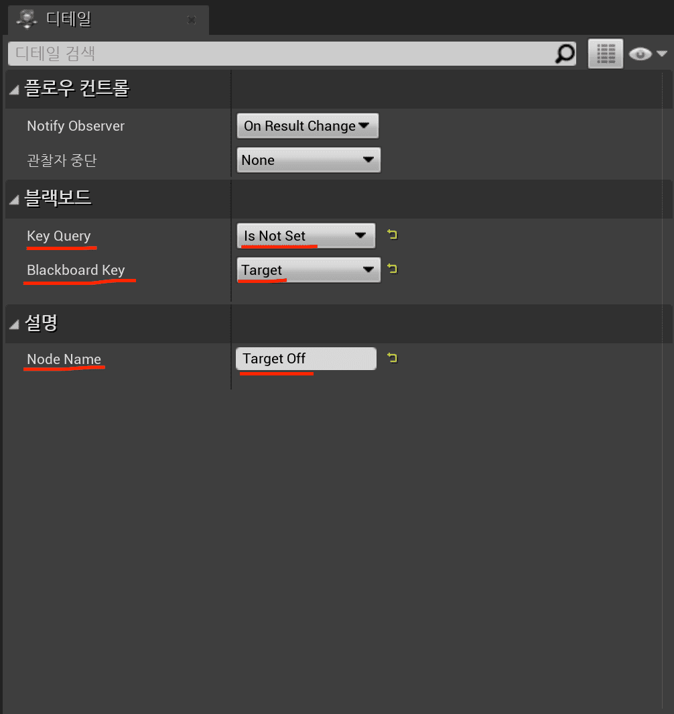

Table of Contents

- [AI Controller](#ai-controller)
- [Behavior Tree](#behavior-tree)

---

## AI Controller

- AI Controller
  > Player가 조종하지 않는 Pawn에 빙의해서 스스로 움직이도록 하는 클래스
  >
  > cf) PlayerController: Player가 움직일 수 있게 하는 클래스

### 무작위로 움직이는 AI를 만들어보자

1. 길 찾기 영역 추가

   > AI가 움직일 영역 지정

   |               Nav Mesh Bounds Volume 추가 및 스케일 지정                | `표시`-`네비게이션` or `P`를 눌러서 확인  |
   | :---------------------------------------------------------------------: | :---------------------------------------: |
   |  |  |

2. `NavigationSystem` 모듈 추가

   - [프로젝트명].Build.cs

     ```cpp
     using UnrealBuildTool;

     public class Test : ModuleRules
     {
         public Test(ReadOnlyTargetRules Target) : base(Target)
         {
             PCHUsage = PCHUsageMode.UseExplicitOrSharedPCHs;

             PublicDependencyModuleNames.AddRange(new string[] { "Core", "CoreUObject", "Engine", "InputCore", "UMG", "NavigationSystem" });

             ...
         }
     }

     ```

3. AI Controller 생성

   |               AI Controller를 상속받는 클래스 생성                |
   | :---------------------------------------------------------------: |
   |  |

   - MyAIController.h

     ```cpp
     #pragma once

     #include "CoreMinimal.h"
     #include "AIController.h"
     #include "MyAIController.generated.h"

     /**
     *
     */
     UCLASS()
     class TEST_API AMyAIController : public AAIController
     {
         GENERATED_BODY()

     public:
         AMyAIController();

         virtual void OnPossess(APawn* InPawn) override;   // 빙의
         virtual void OnUnPossess() override;              // 빙의 해제

     private:
         void RandomMove();

     private:
         FTimerHandle TimerHandle;
     };

     ```

   - MyAIController.cpp

     ```cpp
     #include "MyAIController.h"

     #include "NavigationSystem.h"
     #include "Blueprint/AIBlueprintHelperLibrary.h"


     AMyAIController::AMyAIController()
     {

     }

     void AMyAIController::OnPossess(APawn* InPawn)
     {
         Super::OnPossess(InPawn);

         // 3초마다 RandomMove() 실행
         GetWorld()->GetTimerManager().SetTimer(TimerHandle, this, &AMyAIController::RandomMove, 3.0f, true);
     }

     void AMyAIController::OnUnPossess()
     {
         Super::OnUnPossess();

         GetWorld()->GetTimerManager().ClearTimer(TimerHandle);
     }

     void AMyAIController::RandomMove()
     {
         auto CurrentPawn = GetPawn();

         UNavigationSystemV1* NavSystem = UNavigationSystemV1::GetNavigationSystem(GetWorld());
         if (NavSystem == nullptr)
             return;

         // 구체를 그려서 포지션 확인
         FNavLocation RandomLocation;
         if (NavSystem->GetRandomPointInNavigableRadius(FVector::ZeroVector, 500.0f, RandomLocation))
         {
             // 무작위 이동
             UAIBlueprintHelperLibrary::SimpleMoveToLocation(this, RandomLocation);
         }
     }

     ```

4. MyCharacter에 빙의 시점 설정

   - MyCharacter.cpp

     ```cpp

     ...

     #include "MyHpWidget.h"
     #include "MyAIController.h"

     AMyCharacter::AMyCharacter()
     {
         ...

         // AI Controller 클래스 지정
         AIControllerClass = AMyAIController::StaticClass();
         AutoPossessAI = EAutoPossessAI::PlacedInWorldOrSpawned;   // AI 빙의 시점
     }

     ...

     ```

- 결과

  |                         무작위로 3초마다 움직이는 NPC                         |
  | :---------------------------------------------------------------------------: |
  |  |

---

## Behavior Tree

- Blackboard

  > Behavior Tree 에서 사용할 Data가 모여있다.

  |            Blackboard             |
  | :-------------------------------: |
  |  |

- Behavior Tree

  > Blackboard Data 를 기반으로 AI가 할 행동을 트리 구조로 나타낸다.(= AI의 뇌)
  >
  > 대부분 기획자들이 몬스터 AI를 만들 때, 시각적으로 보면서 기능들을 조합해 몬스터를 제작한다.

  |              Behavior Tree              |
  | :-------------------------------------: |
  |  |

  - Composites

    > N(N > 0)개의 Tasks 를 구성한다.

    |                  Sequence                   |                      Selector                      |                                 Simple Parallel                                  |
    | :-----------------------------------------: | :------------------------------------------------: | :------------------------------------------------------------------------------: |
    |                |                       |                                       |
    |  구성된 Task들을 왼쪽부터 순차적으로 실행   | 구성된 Task들 중 왼쪽부터 시작해 1개의 Task를 실행 | (Default) Finish Mode-Immediate: Main Task가 끝날 때까지 Sub Task를 여러 번 실행 |
    | 하나가 실패하면 나머지 Task를 실행하지 않음 |    하나가 성공하면 나머지 Task를 실행하지 않음     |            Finish Mode-Delayed: Sub Task가 끝날 때까지 Main Task 대기            |

  - Tasks

    > 하나의 작업 실행 단위

    |         Task          |
    | :-------------------: |
    |  |

  - Decorators

    > 분기가 실행되는 조건을 부여한다. True/False 결정(= if)
    >
    > Sequence, Selector, Simple Parallel, Tasks에 부착

    |            Decorator             |
    | :------------------------------: |
    | ) |

  - Services

    > 분기가 실행되는 동안 일정 시간을 간격으로 계속 실행하며, 대부분 Blackboard를 업데이트 한다.
    >
    > Sequence, Selector, Simple Parallel, Tasks에 부착

    |           Service           |
    | :-------------------------: |
    |  |

### Behavior Tree를 이용해 무작위로 움직이는 AI를 만들어보자

1. Behavior Tree, Blackboard 생성

   |                  Behavior Tree 생성                   |                 Blackboard 생성                 |
   | :---------------------------------------------------: | :---------------------------------------------: |
   |  |  |

2. `AIModule`, `GamePlayTasks` 모듈 추가

   - [프로젝트명].Build.cs

     ```cpp
     using UnrealBuildTool;

     public class Test : ModuleRules
     {
         public Test(ReadOnlyTargetRules Target) : base(Target)
         {
             PCHUsage = PCHUsageMode.UseExplicitOrSharedPCHs;

             PublicDependencyModuleNames.AddRange(new string[] { "Core", "CoreUObject", "Engine", "InputCore", "UMG", "NavigationSystem", "AIModule", "GameplayTasks" });

             ...
         }
     }

     ```

3. AI Controller에서 Behavior Tree, Blackboard Data 가져오기

   - MyAIController.h

     ```cpp

     ...

     private:
         UPROPERTY()
         class UBehaviorTree* BehaviorTree;

         UPROPERTY()
         class UBlackboardData* BlackboardData;

     ```

   - MyAIController.cpp

     ```cpp

     ...

     #include "BehaviorTree/BehaviorTree.h"
     #include "BehaviorTree/BlackboardData.h"


     AMyAIController::AMyAIController()
     {
         static ConstructorHelpers::FObjectFinder<UBlackboardData> BD(TEXT("BlackboardData'/Game/AI/BB_MyCharacter.BB_MyCharacter'"));
         if (BD.Succeeded())
         {
             BlackboardData = BD.Object;
         }

         static ConstructorHelpers::FObjectFinder<UBehaviorTree> BT(TEXT("BehaviorTree'/Game/AI/BT_MyCharacter.BT_MyCharacter'"));
         if (BT.Succeeded())
         {
             BehaviorTree = BT.Object;
         }
     }

     void AMyAIController::OnPossess(APawn* InPawn)
     {
         Super::OnPossess(InPawn);

         // 기존 RandomMove() 관련 코드 삭제 - SetTimer

         if (UseBlackboard(BlackboardData, Blackboard))
         {
             if (RunBehaviorTree(BehaviorTree))
             {
                 // Log
             }
         }
     }

     void AMyAIController::OnUnPossess()
     {
         Super::OnUnPossess();

         // 기존 RandomMove() 관련 코드 삭제 - Clear Timer
     }

     ```

4. 무작위 Position을 도출하는 Task 작성(= BTTask_FindPatrolPos)

   > Engine에서 기본적으로 제공해주는 Task 이외에 필요한 Task는 C++ or Blueprint로 만들어서 활용한다.

   |                         C++ BTTask 생성                         |
   | :-------------------------------------------------------------: |
   |  |

   - BTTask_FindPatrolPos.h

     ```cpp
     #pragma once

     #include "CoreMinimal.h"
     #include "BehaviorTree/BTTaskNode.h"
     #include "BTTask_FindPatrolPos.generated.h"

     /**
     *
     */
     UCLASS()
     class TEST_API UBTTask_FindPatrolPos : public UBTTaskNode
     {
         GENERATED_BODY()

     public:
         UBTTask_FindPatrolPos();

         // Blackboard Key Selector 초기화(중요!)
         virtual void InitializeFromAsset(UBehaviorTree& Asset) override;

         // Task 시작할 때 실행할 함수: BeginPlay()와 비슷
         virtual EBTNodeResult::Type ExecuteTask(UBehaviorTreeComponent& OwnerComp, uint8* NodeMemory) override;

     protected:
         UPROPERTY(Category = Distance, EditAnywhere, meta = (ClampMin = "0.0", UIMin = "0.0"))
         float SphereRadius;

         // Patrol Pos Vector 대입 가능한 BlackboardKey
         UPROPERTY(EditAnywhere, Category = Blackboard)
         struct FBlackboardKeySelector BlackboardKey;
     };

     ```

   - BTTask_FindPatrolPos.cpp

     ```cpp
     #include "BTTask_FindPatrolPos.h"

     #include "NavigationSystem.h"
     #include "BehaviorTree/BlackboardComponent.h"
     #include "BehaviorTree/Blackboard/BlackboardKeyType_Vector.h"

     UBTTask_FindPatrolPos::UBTTask_FindPatrolPos()
     {
         // Behavior Tree에서 해당 Task를 만들면 나오는 노드 이름
         NodeName = TEXT("FindPatrolPos");

         // Vector Key만 넣을 수 있도록 필터링
         BlackboardKey.AddVectorFilter(this, GET_MEMBER_NAME_CHECKED(UBTTask_FindPatrolPos, BlackboardKey));
     }

     void UBTTask_FindPatrolPos::InitializeFromAsset(UBehaviorTree& Asset)
     {
         Super::InitializeFromAsset(Asset);

         UBlackboardData* BBAsset = GetBlackboardAsset();
         if (ensure(BBAsset))
         {
             BlackboardKey.ResolveSelectedKey(*BBAsset);
         }
     }

     EBTNodeResult::Type UBTTask_FindPatrolPos::ExecuteTask(UBehaviorTreeComponent& OwnerComp, uint8* NodeMemory)
     {
         // Get Navi-mesh
         UNavigationSystemV1* NavSystem = UNavigationSystemV1::GetNavigationSystem(GetWorld());
         if (NavSystem == nullptr)
             return EBTNodeResult::Failed;

         // Get Random Position from Nav-mesh
         FNavLocation RandomLocation;
         if (NavSystem->GetRandomPointInNavigableRadius(FVector::ZeroVector, SphereRadius, RandomLocation))
         {
             UBlackboardComponent* MyBlackboard = OwnerComp.GetBlackboardComponent();
             if (MyBlackboard && BlackboardKey.SelectedKeyType == UBlackboardKeyType_Vector::StaticClass())
             {
                 MyBlackboard->SetValueAsVector(BlackboardKey.SelectedKeyName, RandomLocation.Location);
             }

             return EBTNodeResult::Succeeded;
         }

         return EBTNodeResult::Failed;
     }

     ```

5. 무작위로 이동할 위치 Blackboard Key 추가

   |        Blackboard 에서 Vector 타입의 Blackboard Key 추가        |
   | :-------------------------------------------------------------: |
   |  |

6. Task 배치하기(in Behavior Tree)

   |       일정 대기 후, 무작위로 이동하는 Behavior Tree 구성        |
   | :-------------------------------------------------------------: |
   |  |

   - Sequence

     > for. 순차적으로 실행

     - Wait
       > 5초 간 대기
     - FindPatrolPos
       > 500cm 반경 구체 안, 무작위로 이동 가능한 위치(= PatrolPos Key) 찾기
     - Move to

       > 무작위로 찾은 위치(= PatrolPos Key로 이동하기

   |                 `Wait` Detail                 |                       `FindPatrolPos` Detail                        |                   `MoveTo` Detail                   |
   | :-------------------------------------------: | :-----------------------------------------------------------------: | :-------------------------------------------------: |
   |  |  |  |

- 결과

  |                          AI가 무작위로 움직이는 모습                          |
  | :---------------------------------------------------------------------------: |
  |  |

### 주변 타겟이 감지되면 공격하는 AI를 만들어보자

1. Blackboard Key 추가

   |        Blackboard 에서 Object 타입의 Blackboard Key 추가        |                 Key Type-Base Class: `MyCharacter`로 지정                 |
   | :-------------------------------------------------------------: | :-----------------------------------------------------------------------: |
   |  |  |

2. 주변 타겟을 감지하는 Service 작성

   |                      Behavior Tree Service 생성                       |
   | :-------------------------------------------------------------------: |
   |  |

   - BTService_DetectTarget.h

     ```cpp
     #pragma once

     #include "CoreMinimal.h"
     #include "BehaviorTree/BTService.h"
     #include "BTService_DetectTarget.generated.h"

     /**
     *
     */
     UCLASS()
     class TEST_API UBTService_DetectTarget : public UBTService
     {
         GENERATED_BODY()

     public:
         UBTService_DetectTarget();

         // Blackboard Key 초기화 함수(중요!)
         virtual void InitializeFromAsset(UBehaviorTree& Asset) override;

         // 일정 Interval로 실행되는 Tick 함수
         virtual void TickNode(UBehaviorTreeComponent& OwnerComp, uint8* NodeMemory, float DeltaSeconds) override;

     protected:
         UPROPERTY(Category = Distance, EditAnywhere, meta = (ClampMin = "0.0", UIMin = "0.0"))
         float DetectRadius = 500.0f;    // 감지 반경

         UPROPERTY(EditAnywhere, Category = Blackboard)
         struct FBlackboardKeySelector BlackboardKey;    // 타겟 설정할 Blackboard Key
     };

     ```

   - BTService_DetectTarget.cpp

     ```cpp
     #include "BTService_DetectTarget.h"

     #include "BehaviorTree/BlackboardComponent.h"
     #include "BehaviorTree/Blackboard/BlackboardKeyType_Object.h"
     #include "MyAIController.h"
     #include "MyCharacter.h"
     #include "DrawDebugHelpers.h"


     UBTService_DetectTarget::UBTService_DetectTarget()
     {
         NodeName = TEXT("Detect Target");
         Interval = 1.0f;

         // BaseClass: AMyCharacter인 Object Key만 넣을 수 있도록 필터링
         BlackboardKey.AddObjectFilter(this, GET_MEMBER_NAME_CHECKED(UBTService_DetectTarget, BlackboardKey), AMyCharacter::StaticClass());
     }

     void UBTService_DetectTarget::InitializeFromAsset(UBehaviorTree& Asset)
     {
         Super::InitializeFromAsset(Asset);

         UBlackboardData* BBAsset = GetBlackboardAsset();
         if (ensure(BBAsset))
         {
             BlackboardKey.ResolveSelectedKey(*BBAsset);
         }
     }

     void UBTService_DetectTarget::TickNode(UBehaviorTreeComponent& OwnerComp, uint8* NodeMemory, float DeltaSeconds)
     {
         Super::TickNode(OwnerComp, NodeMemory, DeltaSeconds);

         auto CurrentPawn = OwnerComp.GetAIOwner()->GetPawn();
         if (CurrentPawn == nullptr)
             return;

         UWorld* World = CurrentPawn->GetWorld();
         if (World == nullptr)
             return;

         FVector Center = CurrentPawn->GetActorLocation();
         TArray<FOverlapResult> OverlapResults;
         FCollisionQueryParams QueryParams(NAME_None, false, CurrentPawn); // IgnoreActor: CurrentPawn

         bool bResult = World->OverlapMultiByChannel(
             OverlapResults,
             Center,             // 현재 위치부터
             FQuat::Identity,    // 회전 변경 없이
             ECollisionChannel::ECC_GameTraceChannel2,   // Attack Trace Channel
             FCollisionShape::MakeSphere(DetectRadius),  // 구체
             QueryParams
         );

         if (bResult)
         {
             // 감지 성공

             for (auto& OverlapResult : OverlapResults)
             {
                 AMyCharacter* MyCharacter = Cast<AMyCharacter>(OverlapResult.GetActor());

                 // AI와 Player가 동일한 Character를 쓰기 때문에 PlayerController 검사
                 if (MyCharacter && MyCharacter->GetController()->IsPlayerController())
                 {
                     UBlackboardComponent* MyBlackboard = OwnerComp.GetBlackboardComponent();
                     if (MyBlackboard && BlackboardKey.SelectedKeyType == UBlackboardKeyType_Object::StaticClass())
                     {
                         // 감지된 캐릭터를 Blackboard Key에 설정
                         MyBlackboard->SetValueAsObject(BlackboardKey.SelectedKeyName, MyCharacter);

                         // 감지되면 빨강색 디버깅
                         DrawDebugSphere(World, Center, DetectRadius, 16, FColor::Red, false, 0.2f);
                     }
                 }
             }
         }
         else
         {
             // 감지 실패

             UBlackboardComponent* MyBlackboard = OwnerComp.GetBlackboardComponent();
             if (MyBlackboard && BlackboardKey.SelectedKeyType == UBlackboardKeyType_Object::StaticClass())
             {
                 // 감지 되지 않으면 Blackboard Key를 nullptr로 설정
                 MyBlackboard->SetValueAsObject(BlackboardKey.SelectedKeyName, nullptr);

                 // 감지 안되면 초록색 디버깅
                 DrawDebugSphere(World, Center, DetectRadius, 16, FColor::Green, false, 0.2f);
             }
         }
     }

     ```

3. 유효 범위에 있는지 체크하는 Decorator 작성

   |                       Behavior Tree Decorator 생성                        |
   | :-----------------------------------------------------------------------: |
   |  |

   - BTDecorator_CloseTo.h

     ```cpp
     #pragma once

     #include "CoreMinimal.h"
     #include "BehaviorTree/BTDecorator.h"
     #include "BTDecorator_CloseTo.generated.h"

     /**
     *
     */
     UCLASS()
     class TEST_API UBTDecorator_CloseTo : public UBTDecorator
     {
         GENERATED_BODY()

     public:
         UBTDecorator_CloseTo();

         // Blackboard Key 초기화(중요!)
         virtual void InitializeFromAsset(UBehaviorTree& Asset) override;

         // 조건 검사
         virtual bool CalculateRawConditionValue(UBehaviorTreeComponent& OwnerComp, uint8* NodeMemory) const;

     protected:
         UPROPERTY(Category = Distance, EditAnywhere, meta = (ClampMin = "0.0", UIMin = "0.0"))
         float Distance = 200.0f;    // 거리

         UPROPERTY(EditAnywhere, Category = Blackboard)
         struct FBlackboardKeySelector BlackboardKey;    // 거리 체크할 오브젝트
     };

     ```

   - BTDecorator_CloseTo.cpp

     ```cpp
     #include "BTDecorator_CloseTo.h"

     #include "BehaviorTree/BlackboardComponent.h"
     #include "BehaviorTree/Blackboard/BlackboardKeyType_Object.h"
     #include "MyAIController.h"
     #include "MyCharacter.h"


     UBTDecorator_CloseTo::UBTDecorator_CloseTo()
     {
         NodeName = TEXT("Close To");

         // BaseClass: AMyCharacter인 Object Key만 넣을 수 있도록 필터링
         BlackboardKey.AddObjectFilter(this, GET_MEMBER_NAME_CHECKED(UBTDecorator_CloseTo, BlackboardKey), AMyCharacter::StaticClass());
     }

     void UBTDecorator_CloseTo::InitializeFromAsset(UBehaviorTree& Asset)
     {
         Super::InitializeFromAsset(Asset);

         UBlackboardData* BBAsset = GetBlackboardAsset();
         if (ensure(BBAsset))
         {
             BlackboardKey.ResolveSelectedKey(*BBAsset);
         }
     }

     bool UBTDecorator_CloseTo::CalculateRawConditionValue(UBehaviorTreeComponent& OwnerComp, uint8* NodeMemory) const
     {
         bool bResult = Super::CalculateRawConditionValue(OwnerComp, NodeMemory);

         auto CurrentPawn = OwnerComp.GetAIOwner()->GetPawn();
         if (CurrentPawn == nullptr)
           return false;

         UBlackboardComponent* MyBlackboard = OwnerComp.GetBlackboardComponent();
         if (MyBlackboard && BlackboardKey.SelectedKeyType == UBlackboardKeyType_Object::StaticClass())
         {
             auto Target = Cast<AMyCharacter>(MyBlackboard->GetValueAsObject(BlackboardKey.SelectedKeyName));
             if (Target == nullptr)
                 return false;

             // 타겟과의 거리 차
             bResult = Target->GetDistanceTo(CurrentPawn) <= Distance;
         }

         return bResult;
     }

     ```

4. 공격을 시도하는 Task 추가 및 작성

   - BTTask_Attack.h

     ```cpp
     #pragma once

     #include "CoreMinimal.h"
     #include "BehaviorTree/BTTaskNode.h"
     #include "BTTask_Attack.generated.h"

     /**
     *
     */
     UCLASS()
     class TEST_API UBTTask_Attack : public UBTTaskNode
     {
         GENERATED_BODY()

     public:
         UBTTask_Attack();

         // Task 시작되면 호출되는 함수
         virtual EBTNodeResult::Type ExecuteTask(UBehaviorTreeComponent& OwnerComp, uint8* NodeMemory) override;

         // Task가 실행되는 동안 호출되는 함수
         virtual void TickTask(UBehaviorTreeComponent& OwnerComp, uint8* NodeMemory, float DeltaSeconds) override;

     private:
         bool bIsAttacking = false;    // 공격 중 여부 검사
     };

     ```

   - BTTask_Attack.cpp

     ```cpp
     #include "BTTask_Attack.h"

     #include "MyAIController.h"
     #include "MyCharacter.h"


     UBTTask_Attack::UBTTask_Attack()
     {
         // Tick 허용
         bNotifyTick = true;
     }

     EBTNodeResult::Type UBTTask_Attack::ExecuteTask(UBehaviorTreeComponent& OwnerComp, uint8* NodeMemory)
     {
         EBTNodeResult::Type Result = Super::ExecuteTask(OwnerComp, NodeMemory);

         auto MyCharacter = Cast<AMyCharacter>(OwnerComp.GetAIOwner()->GetPawn());
         if (MyCharacter == nullptr)
             return EBTNodeResult::Failed;

         // 공격 시도
         MyCharacter->Attack();
         bIsAttacking = true;

         // MyCharacter의 AttackMontage 끝나면 실행될 람다 등록
         MyCharacter->OnAttackEnd.AddLambda([this]()
             {
                 // this: 현재 Task 객체를 참조 (for. this의 bIsAttacking 사용)
                 bIsAttacking = false;
             }
         );

         return Result;
     }

     void UBTTask_Attack::TickTask(UBehaviorTreeComponent& OwnerComp, uint8* NodeMemory, float DeltaSeconds)
     {
         Super::TickTask(OwnerComp, NodeMemory, DeltaSeconds);

         // 공격 끝나면 종료(= Task 성공)
         if (bIsAttacking == false)
             FinishLatentTask(OwnerComp, EBTNodeResult::Succeeded);
     }

     ```

   - AttackMontage가 끝날 경우에 실행되는 Delegate 추가

     - MyCharacter.h

       ```cpp

       ...

       DECLARE_MULTICAST_DELEGATE(FOnAttackEnd);

       ...

       public:
           FOnAttackEnd OnAttackEnd;

       ...

       ```

     - MyCharacter.h

       ```cpp

       ...

       void AMyCharacter::OnAttackMontageEnded(UAnimMontage* Montage, bool bInterrupted)
       {
           IsAttacking = false;

           OnAttackEnd.Broadcast();
       }

       ...

       ```

5. Task, Service, Decorator 배치

   |                          Selector 배치                          |                           Decorator 배치                            |
   | :-------------------------------------------------------------: | :-----------------------------------------------------------------: |
   |  |  |

   |                 주변 타겟이 감지되면 공격하는 Behavior Tree 구성                  |
   | :-------------------------------------------------------------------------------: |
   |  |

   - Root

     - Selector(: `BTService_DetectTarget`)

       > 주변 타겟 감지

       - Selector(: `BTDecorator_Blackboard`)
         > 감지된 상태
         - Sequence(: `BTDecorator_CloseTo`)
           > 공격 범위 안
           - `BTTask_Attack`
             > 공격
         - Sequence(: `BTDecorator_CloseTo`)
           > 공격 범위 밖
           - `BTTask_MoveTo`
             > 타겟으로 이동
       - Sequence(: `BTDecorator_Blackboard`)
         > 감지되지 않은 상태
         - `BTTask_Wait`
           > 대기
         - `BTTask_FindPatrolPos`
           > 무작위 이동할 위치 탐색
         - `BTTask_MoveTo`
           > 찾은 위치 이동

   |             `BTService_DetectTarget` Detail             |
   | :-----------------------------------------------------: |
   |  |

   |                `BTDecorator_Blackboard`(= `Target On`) Detail                 |                 `BTDecorator_Blackboard`(= `Target Off`) Detail                 |
   | :---------------------------------------------------------------------------: | :-----------------------------------------------------------------------------: |
   |  |  |

   |          `BTDecorator_CloseTo`(= `Can Attack`) Detail           |                `BTDecorator_CloseTo`(= `Can not Attack`) Detail                 |
   | :-------------------------------------------------------------: | :-----------------------------------------------------------------------------: |
   |  |  |

- 결과

  |                  타겟 감지가 되면 공격하러 오는 AI                  |
  | :-----------------------------------------------------------------: |
  |  |

---
