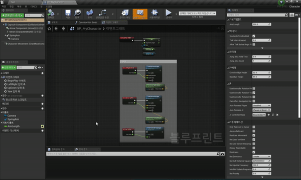
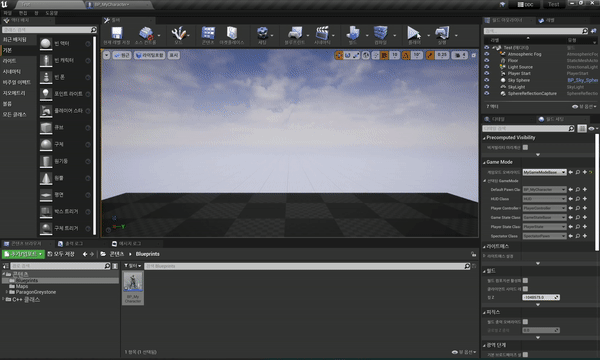
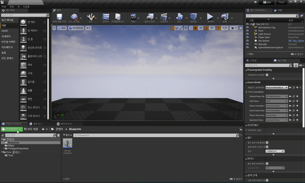
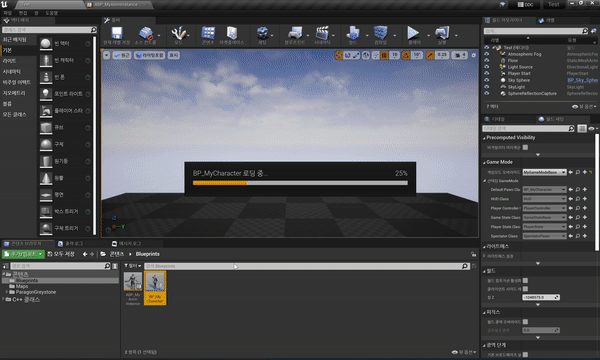
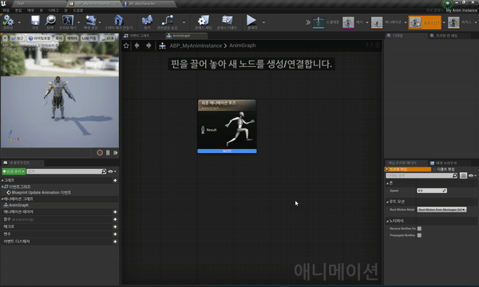
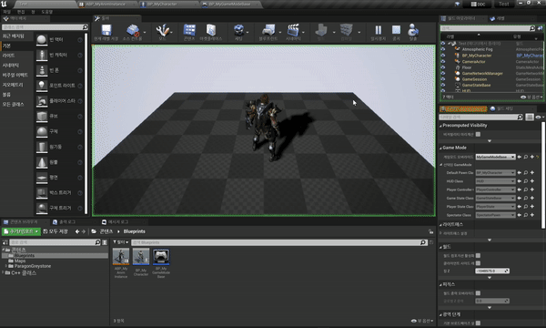
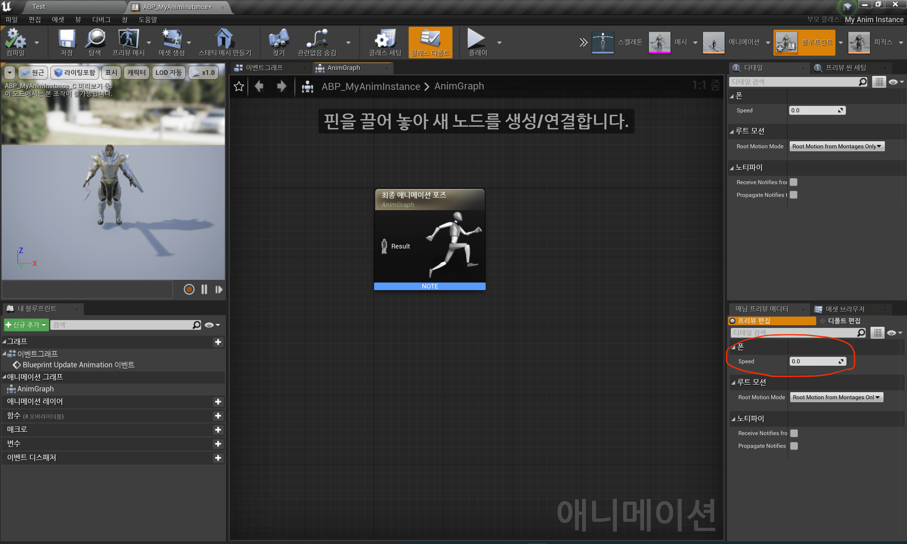
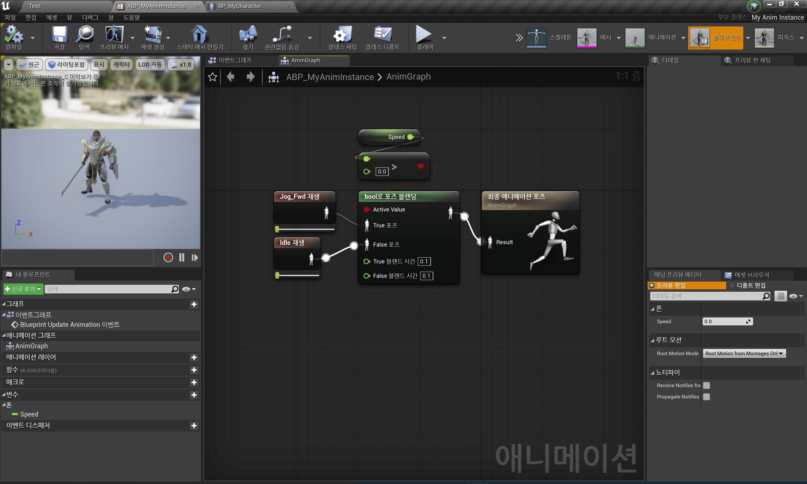
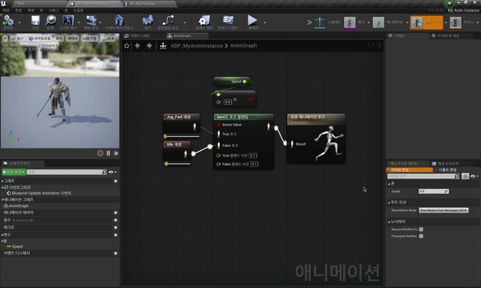
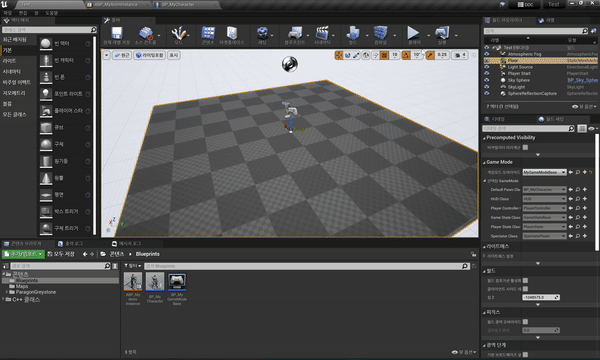

## 애니메이션 기초

- Skeletal Mesh는 애니메이션을 실행하는 뼈(Bone)을 가지고 있고, 이를 이용해 애니메이션을 실행한다.

- Skeletal Mesh의 Animation 카테고리

  - Use Animation Blueprint
    > 가장 많이 쓰이는 방법.
    >
    > 애니메이션 블루프린트를 생성해 애니메이션 관련한 것은 해당 블루프린트에서 관리한다.
  - Use Animation Asset
    > 가장 간단하게 하나의 애니메이션을 실행할 때 사용.
  - Use Custom Mode
    > 사용자 정의 모드.
    >
    > 시퀀서에서 해당 스켈레탈 메시의 애니메이션을 실행할 경우에 사용된다.

- 애니메이션을 코드로 관리한다는 건 직관적이지만, 유지보수하기 힘들다.
  - 애니메이션 블루프린트를 이용해 관리한다.

### `Use Animation Asset`으로 간단하게 애니메이션 실행해보자

- 가장 간단하게 애니메이션 실행 가능하다.

  - 인게임에서 하나의 애니메이션이 계속 실행된다.

1. Skeletal Mesh의 Animation 카테고리에서 `Use Animation Asset`을 적용

|               공격 애니메이션을 추가                |
| :-------------------------------------------------: |
|  |

- 결과

|          인게임에서 공격 애니메이션이 계속 실행되는 결과          |
| :---------------------------------------------------------------: |
|  |

### `Use Animation Blueprint`로 애니메이션 실행해보자

1. `AnimInstance` Class 를 상속받는 "MyAnimInstance" Class 생성

   - MyAnimInstance.h

     ```cpp
     #pragma once

     #include "CoreMinimal.h"
     #include "Animation/AnimInstance.h"
     #include "MyAnimInstance.generated.h"


     UCLASS()
     class TEST_API UMyAnimInstance : public UAnimInstance
     {
         GENERATED_BODY()

     private:
         UPROPERTY(EditAnywhere, BlueprintReadOnly, Category = Pawn, Meta = (AllowPrivateAccess = true))
         float Speed;
     };
     ```

2. 애니메이션 블루프린트 생성 및 사용

   - Animation Instance를 사용하는 애니메이션 블루프린트를 별도로 생성해야 한다.

     |                  애니메이션 블루프린트 생성 과정                  |              캐릭터 블루프린트에 애니메이션 블루프린트 사용 설정              |
     | :---------------------------------------------------------------: | :---------------------------------------------------------------------------: |
     |  |  |

3. Animation 추가

   |                Idle Animation 추가                |
   | :-----------------------------------------------: |
   |  |

- 결과

  |                      애니메이션 블루프린트 사용 결과                      |
  | :-----------------------------------------------------------------------: |
  |  |

### Speed 변수 이용해서 뛰기 애니메이션 추가

- 애니메이션 블루프린트는 `MyAnimInstance`를 상속받았기 때문에 "Speed" 변수를 가지고 있다.

  |                       상속받은 Speed 변수                       |
  | :-------------------------------------------------------------: |
  |  |

1. Speed 값에 따라 애니메이션 달라지도록 블루프린트 그래프 작성

   |                 bool 블랜딩 이용한 이벤트 그래프 작성                 |                    "Speed" 변경하며 Preview 확인                    |
   | :-------------------------------------------------------------------: | :-----------------------------------------------------------------: |
   |  |  |

2. Speed 값 조절하는 C++ MyAnimInstance Class 작성

   - MyAnimInstance.h

     ```cpp
     #pragma once

     #include "CoreMinimal.h"
     #include "Animation/AnimInstance.h"
     #include "MyAnimInstance.generated.h"


     UCLASS()
     class TEST_API UMyAnimInstance : public UAnimInstance
     {
         GENERATED_BODY()

     public:
         // Native가 붙으면 인게임 뿐만 아니라 에디터 내에서도 호출
         virtual void NativeUpdateAnimation(float DeltaSeconds) override;

     private:
         UPROPERTY(EditAnywhere, BlueprintReadOnly, Category = Pawn, Meta = (AllowPrivateAccess = true))
         float Speed;

     };
     ```

   - MyAnimInstance.cpp

     ```cpp
     #include "MyGameModeBase.h"
     #include "MyCharacter.h"

     AMyGameModeBase::AMyGameModeBase()
     {
         //DefaultPawnClass = AMyCharacter::StaticClass();    // Static 객체

         static ConstructorHelpers::FClassFinder<ACharacter> BP_CHARACTER(TEXT("Blueprint'/Game/Blueprints/BP_MyCharacter.BP_MyCharacter_C'"));
         if (BP_CHARACTER.Succeeded())
         {
             DefaultPawnClass = BP_CHARACTER.Class;
         }
     }
     ```

- 결과

  |                      캐릭터 이동에 따라 애니메이션 변화                       |
  | :---------------------------------------------------------------------------: |
  |  |

---
