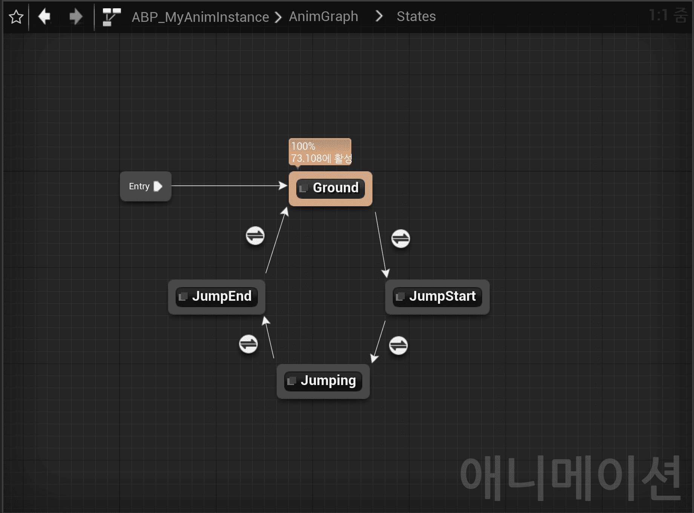
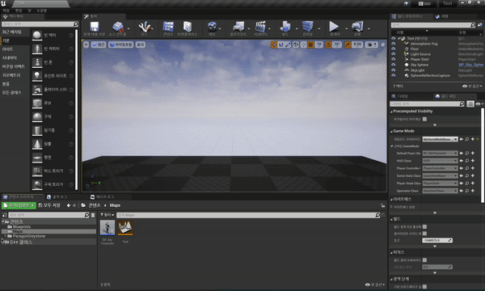

Table of Contents

- [애니메이션 기초](#애니메이션-기초)
- [스테이트 머신(State Machine)](#스테이트-머신state-machine)
- [애니메이션 몽타주(Animation Montage)](#애니메이션-몽타주animation-montage)

## 애니메이션 기초

- Skeletal Mesh는 애니메이션을 실행하는 뼈(Bone)을 가지고 있고, 이를 이용해 애니메이션을 실행한다.

- Skeletal Mesh의 Animation 카테고리

  - Use Animation Blueprint
    > 가장 많이 쓰이는 방법.
    >
    > 애니메이션 블루프린트를 생성해 애니메이션 관련한 것은 해당 블루프린트에서 관리한다.
  - Use Animation Asset
    > 가장 간단하게 하나의 애니메이션을 실행할 때 사용.
  - Use Custom Mode
    > 사용자 정의 모드.
    >
    > 시퀀서에서 해당 스켈레탈 메시의 애니메이션을 실행할 경우에 사용된다.

- 애니메이션을 코드로 관리한다는 건 직관적이지만, 유지보수하기 힘들다.
  - 애니메이션 블루프린트를 이용해 관리한다.

### `Use Animation Asset`으로 간단하게 애니메이션 실행해보자

- 가장 간단하게 애니메이션 실행 가능하다.

  - 인게임에서 하나의 애니메이션이 계속 실행된다.

1. Skeletal Mesh의 Animation 카테고리에서 `Use Animation Asset`을 적용

|               공격 애니메이션을 추가                |
| :-------------------------------------------------: |
|  |

- 결과

|          인게임에서 공격 애니메이션이 계속 실행되는 결과          |
| :---------------------------------------------------------------: |
|  |

### `Use Animation Blueprint`로 애니메이션 실행해보자

1. `AnimInstance` Class 를 상속받는 "MyAnimInstance" Class 생성

   - MyAnimInstance.h

     ```cpp
     #pragma once

     #include "CoreMinimal.h"
     #include "Animation/AnimInstance.h"
     #include "MyAnimInstance.generated.h"


     UCLASS()
     class TEST_API UMyAnimInstance : public UAnimInstance
     {
         GENERATED_BODY()

     private:
         UPROPERTY(EditAnywhere, BlueprintReadOnly, Category = Pawn, Meta = (AllowPrivateAccess = true))
         float Speed;
     };
     ```

2. 애니메이션 블루프린트 생성 및 사용

   - Animation Instance를 사용하는 애니메이션 블루프린트를 별도로 생성해야 한다.

     |                  애니메이션 블루프린트 생성 과정                  |              캐릭터 블루프린트에 애니메이션 블루프린트 사용 설정              |
     | :---------------------------------------------------------------: | :---------------------------------------------------------------------------: |
     |  |  |

3. Animation 추가

   |                Idle Animation 추가                |
   | :-----------------------------------------------: |
   |  |

- 결과

  |                      애니메이션 블루프린트 사용 결과                      |
  | :-----------------------------------------------------------------------: |
  |  |

### Speed 변수 이용해서 뛰기 애니메이션 추가

- 애니메이션 블루프린트는 `MyAnimInstance`를 상속받았기 때문에 "Speed" 변수를 가지고 있다.

  |                       상속받은 Speed 변수                       |
  | :-------------------------------------------------------------: |
  |  |

1. Speed 값에 따라 애니메이션 달라지도록 블루프린트 그래프 작성

   |                 bool 블랜딩 이용한 이벤트 그래프 작성                 |                    "Speed" 변경하며 Preview 확인                    |
   | :-------------------------------------------------------------------: | :-----------------------------------------------------------------: |
   |  |  |

2. Speed 값 조절하는 C++ MyAnimInstance Class 작성

   - MyAnimInstance.h

     ```cpp
     #pragma once

     #include "CoreMinimal.h"
     #include "Animation/AnimInstance.h"
     #include "MyAnimInstance.generated.h"


     UCLASS()
     class TEST_API UMyAnimInstance : public UAnimInstance
     {
         GENERATED_BODY()

     public:
         // Native가 붙으면 인게임 뿐만 아니라 에디터 내에서도 호출
         virtual void NativeUpdateAnimation(float DeltaSeconds) override;

     private:
         UPROPERTY(EditAnywhere, BlueprintReadOnly, Category = Pawn, Meta = (AllowPrivateAccess = true))
         float Speed;

     };
     ```

   - MyAnimInstance.cpp

     ```cpp
     #include "MyGameModeBase.h"
     #include "MyCharacter.h"

     AMyGameModeBase::AMyGameModeBase()
     {
         //DefaultPawnClass = AMyCharacter::StaticClass();    // Static 객체

         static ConstructorHelpers::FClassFinder<ACharacter> BP_CHARACTER(TEXT("Blueprint'/Game/Blueprints/BP_MyCharacter.BP_MyCharacter_C'"));
         if (BP_CHARACTER.Succeeded())
         {
             DefaultPawnClass = BP_CHARACTER.Class;
         }
     }
     ```

- 결과

  |                      캐릭터 이동에 따라 애니메이션 변화                       |
  | :---------------------------------------------------------------------------: |
  |  |

---

## 스테이트 머신(State Machine)

- 스테이트 머신(State Machine) 이란?

  > 각 상태(State)들로 관리할 수 있는 프레임워크

- 스테이트 머신(State Machine)을 쓰는 이유?

  > 애니메이션이 점점 많아질 경웨 기존 방식인 "True/False"로 쓰면 복잡해지기도 하고, 보기도 어렵기 때문에 상태 별로 관리할 수 있도록 사용한다.

  |                           bool(if-else)                           |                     State Machine                     |
  | :---------------------------------------------------------------: | :---------------------------------------------------: |
  |  |  |

### 스테이트 머신으로 점프를 구현해보자

1. Jumping Transition 조건 설정

   - Jump 키 액션 맵핑

     |                Jump 입력 바인딩 추가                |
     | :-------------------------------------------------: |
     |  |

   - MyCharacter.cpp

     ```cpp

     ...

     void AMyCharacter::SetupPlayerInputComponent(UInputComponent* PlayerInputComponent)
     {
         Super::SetupPlayerInputComponent(PlayerInputComponent);

         // Action 바인딩
         // ACharacter에 이미 Jump 함수가 만들어져있다.
         PlayerInputComponent->BindAction(TEXT("Jump"), EInputEvent::IE_Pressed, this, &AMyCharacter::Jump);

         // Axis 바인딩
         ... // UpDown, LeftRight, Yaw
     }

     ...

     ```

   - MyAnimInstance.h

     ```cpp

     ...

     private:
         ...

         UPROPERTY(EditAnywhere, BlueprintReadOnly, Category = Pawn, Meta = (AllowPrivateAccess = true))
         bool IsFalling;

     ...

     ```

   - MyAnimInstance.cpp

     ```cpp

     ...

     void UMyAnimInstance::NativeUpdateAnimation(float DeltaSeconds)
     {
         Super::NativeUpdateAnimation(DeltaSeconds);    // GENERATE_BODY()에 Super 키워드 존재

         APawn* MyPawn = TryGetPawnOwner();
         if (IsValid(MyPawn))
         {
             Speed = MyPawn->GetVelocity().Size();

             ACharacter* MyCharacter = Cast<ACharacter>(MyPawn);
             if (MyCharacter)
             {
                 // MovementComponent에 IsFalling()이 만들어져있다.
                 IsFalling = MyCharacter->GetMovementComponent()->IsFalling();
             }
         }
     }

     ```

2. State Machine 생성, 각 State 추가

   - State Machine 생성

     |          State Machine 생성 및 각 State 추가          |
     | :---------------------------------------------------: |
     |  |

   |                Ground                 |                  Jump Start                   |                 Jumping                 |                 Jump End                  |
   | :-----------------------------------: | :-------------------------------------------: | :-------------------------------------: | :---------------------------------------: |
   |          땅에 발이 붙은 상태          |              점프 시작하는 시점               |            공중에 있는 상태             |            땅에 착지하는 시점             |
   |      대기, 걷기 애니메이션 추가       |           점프 시작 애니메이션 추가           |    공중에서 떨어지는 애니메이션 추가    |       땅에 착지하는 애니메이션 추가       |
   |  |  |  |  |

3. Transition 조건 적용: 2가지 방법으로 전환

   |                 Transition 생성                 |
   | :---------------------------------------------: |
   |  |

   - Time Remaining (ratio) 이용

     > 현재 State의 애니메이션 에셋의 남은 시간 길이의 비율을 이용해 다음 State로 전환되도록 설정해준다.

     |            `Jump Start State` -> `Jumping State` Transition             |
     | :---------------------------------------------------------------------: |
     |  |

   - Automatic Rule Based on Sequence Player in State 이용

     > 가장 영향력이 큰 노드의 남은 시간을 이용해 자동으로 룰을 설정을 해준다.

     |           `Jumping State` -> `Jump End State` Transition            |
     | :-----------------------------------------------------------------: |
     |  |

- 결과

  | `Ground` -> `Jump Start` -> `Jumping` -> `Jump End` -> `Ground` |
  | :-------------------------------------------------------------: |
  |  |

---

## 애니메이션 몽타주(Animation Montage)

- 애니메이션 몽타주(Animation Montage)
  > 애니메이션을 편집해서 퀄리티 있는 애니메이션을 만드는 기법
  >
  > 특정 지점(노티파이)에 사운드, 이팩트를 넣기 편리하고, 섹션별로 나누어 콤보 애니메이션도 만들 수 있다.

### 콤보 애니메이션을 만들어보자

1. 메시의 에셋 생성

   |               애니메이션 몽타주 생성                |
   | :-------------------------------------------------: |
   |  |

2. 몽타주 섹션에 애니메이션 에셋 추가

   |           Attack_A, Attack_B, Attack_C 추가           |
   | :---------------------------------------------------: |
   |  |

3. Attack 입력 키 추가

   - Attack 키 액션 맵핑

     |                 Attack 입력 바인딩 추가                 |
     | :-----------------------------------------------------: |
     |  |

   - MyCharacter.h

     ```cpp

     ...
     public:
         ...

         void Attack();

     ...

     ```

   - MyCharacter.cpp

     ```cpp

     ...
     #include "MyAnimInstance.h"

     ...

     void AMyCharacter::SetupPlayerInputComponent(UInputComponent* PlayerInputComponent)
     {
         Super::SetupPlayerInputComponent(PlayerInputComponent);

         // 액션을 바인딩한다.(눌렀다 뗐다 정도)
         ...   // Jump

         // Attack Binding
         PlayerInputComponent->BindAction(TEXT("Attack"), EInputEvent::IE_Pressed, this, &AMyCharacter::Attack);

         // Player Controller 에서 바인딩하면 먼저 선점 가능하다.
         ... // Left, Right, Yaw
     }

     ...

     void AMyCharacter::Attack()
     {
         UMyAnimInstance* AnimInstance = Cast<UMyAnimInstance>(GetMesh()->GetAnimInstance());
         if (AnimInstance)
         {
             AnimInstance->PlayAttackMontage();
         }
     }

     ```

   - MyAnimInstance.h

     ```cpp

     ...

     public:
         UMyAnimInstance();    // Montage를 가져오는 시점

         ...

       void PlayAttackMontage();    // Attack Montage 실행

     private:
         ...

         UPROPERTY(EditAnywhere, BlueprintReadOnly, Category = Pawn, Meta = (AllowPrivateAccess = true))
         UAnimMontage* AttackMontage;

     ...

     ```

   - MyAnimInstance.cpp

     ```cpp

     ...

     UMyAnimInstance::UMyAnimInstance()
     {
         static ConstructorHelpers::FObjectFinder<UAnimMontage> AM(TEXT("AnimMontage'/Game/Animations/Greystone_Skeleton_Montage.Greystone_Skeleton_Montage'"));
         if (AM.Succeeded())
         {
             AttackMontage = AM.Object;
         }
     }

     ...

     void UMyAnimInstance::PlayAttackMontage()
     {
         // 몽타주 중복 실행 방지
         if (!Montage_IsPlaying(AttackMontage))
         {
             // 몽타주 실행, 재생속도: 1.0f
             Montage_Play(AttackMontage, 1.0f);
         }
     }

     ```

4. Default Slot 추가(필수!)

   > `Default Slot`을 추가해 몽타주가 실행 가능하도록 한다.
   >
   > 여러 개 추가 가능하며, 특정 State 뒤에 위치시켜 해당 State를 진행 중에 몽타주가 실행할 수 있게 한다.

   | 모든 애니메이션에서 몽타주가 바로 실행되도록 위치 지정 |
   | :----------------------------------------------------: |
   |           |

- 결과

  |                    3단 공격 애니메이션                    |
  | :-------------------------------------------------------: |
  |  |

---

## 델레게이트(Delegate)

- 델레게이트란(Delegate)?
  > "대리자" 라는 뜻으로, 함수 포인터로서 작용되고 지정된 함수를 호출해준다.
  >
  > 델레게이트를 쓰면 매 프레임마다 체크할 필요가 없고 특정 시점에 함수를 실행할 수 있도록 가능하다.
  >
  > ex) "A 함수가 끝날 때, B 함수를 호출해주세요."라면 매 틱마다 A 함수가 끝났는지 계속 검사하는 게 아니라 델레게이트로 B 함수를 A가 끝났을 경우에 델레게이트로 B 함수를 호출하도록 한다.

### 델레게이트를 이용해 공격 중인지 검사해보자

1. MyCharacter 코드 수정

   - MyCharacter.h

     ```cpp

     ...

     public:
         // 델레게이트가 실행시켜줄 함수
         UFUNCTION()
         void OnAttackMontageEnded(UAnimMontage* Montage, bool bInterrupted);

     private:
         ...

         UPROPERTY()
         class UMyAnimInstance* AnimInstance;

         UPROPERTY(VisibleAnywhere, Category = Pawn)
         bool IsAttacking = false;

     ```

   - MyCharacter.cpp

     ```cpp

     ...

     // 추후에 수명 주기에 따라 PostInitializeComponents에 추가해도 될 듯 하다.
     void AMyCharacter::BeginPlay()
     {
         Super::BeginPlay();

         AnimInstance = Cast<UMyAnimInstance>(GetMesh()->GetAnimInstance());
         AnimInstance->OnMontageEnded.AddDynamic(this, &AMyCharacter::OnAttackMontageEnded);
     }

     ...

     void AMyCharacter::Attack()
     {
         if (IsAttacking)
             return;

         AnimInstance->PlayAttackMontage();

         IsAttacking = true;
     }

     // 델레게이트가 실행시켜줄 함수
     void AMyCharacter::OnAttackMontageEnded(UAnimMontage* Montage, bool bInterrupted)
     {
         IsAttacking = false;
     }
     ```

2. MyAnimInstance 코드 수정

   - MyAnimInstance.cpp

     ```cpp

     ...

     void UMyAnimInstance::PlayAttackMontage()
     {
         // 몽타주가 플레이 중인지 체크 -> 체크할 필요 X
         // if (!Montage_IsPlaying(AttackMontage))

         Montage_Play(AttackMontage, 1.0f);
     }

     ```

- 결과

  | 공격 중: `IsAttacking(true)`, 공격 완료: `IsAttacking(false)` |
  | :-----------------------------------------------------------: |
  |      |

---
