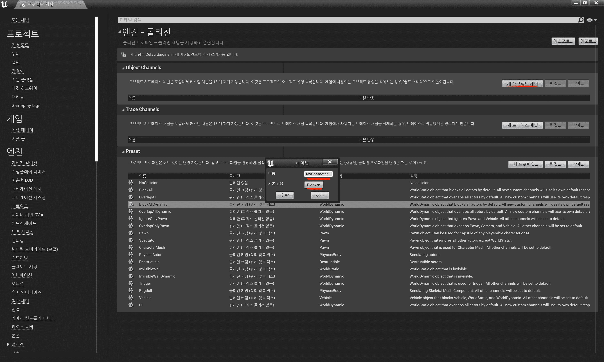
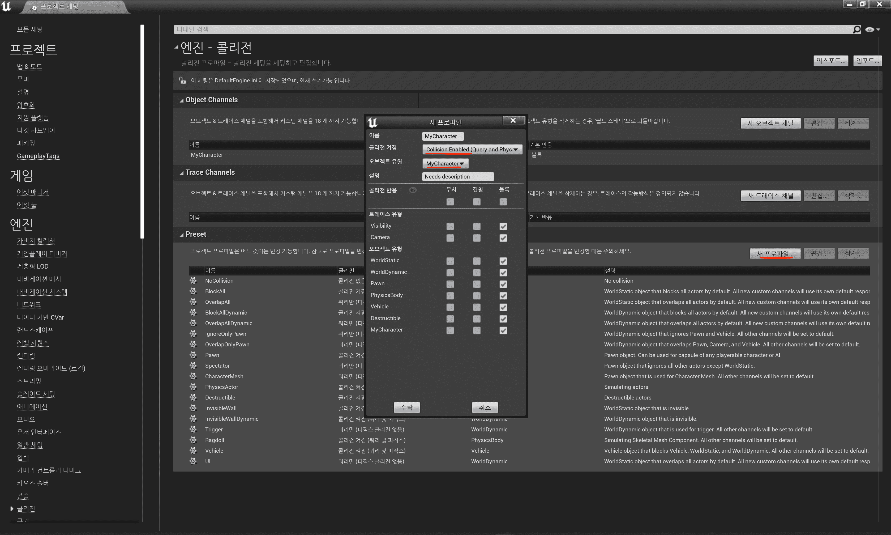
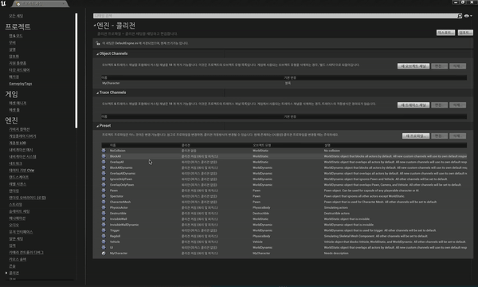
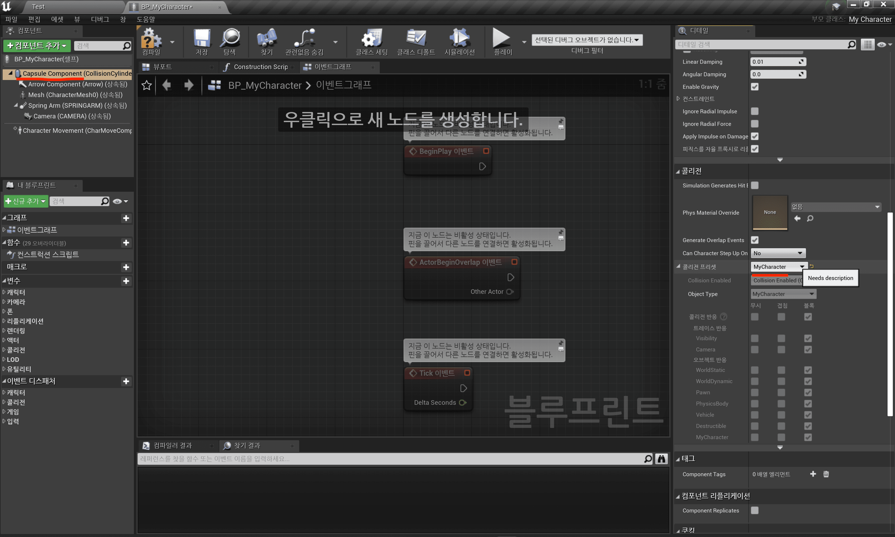
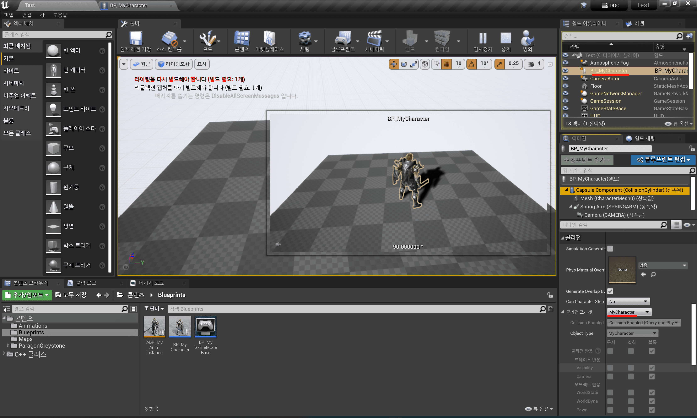
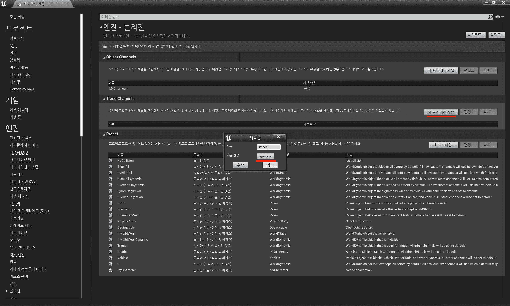
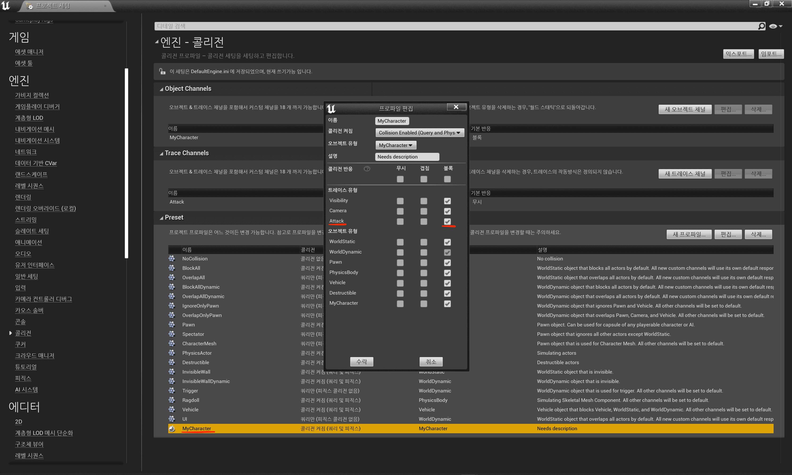
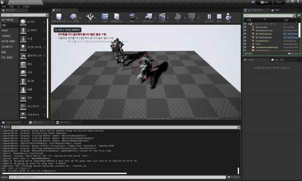
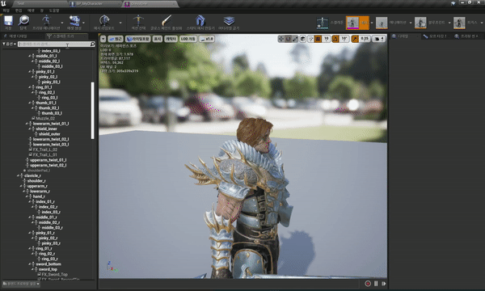
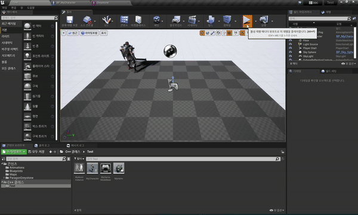

Table of Contents

- [충돌 기초](#충돌-기초)
- [소켓 실습](#소켓-실습)

## 충돌 기초

- 용어 정리

  - 콜리전(Collision)
    > 두 객체가 서로 겹치는 or 겹쳐지지 않는 과정에서 생기는 이벤트.
  - 콜라이더(Collider)
    > 충돌 처리를 위해 사용하는 오브젝트로 보이지 않는다.
  - Trace
    > 레벨 안에서 직선 상으로 무엇이 존재하는지 확인한다.
    >
    > Unity에서는 `Raycast`라 한다.
  - Sweep
    > 특정 모양(Sphere, Box, Capsule)의 형태로 Trace 한다.

- 충돌 처리 예시

  1. 땅에서 걸을 때
     > 내 캐릭터와 땅과 충돌 처리 필요
  2. NPC에게 말을 걸 때
     > 내 캐릭터와 NPC와 충돌 처리 필요
  3. 포탈을 타고 다른 맵으로 넘어갈 때
     > 내 캐릭터와 포탈과 충돌 처리 필요
  4. 내 캐릭터가 휘두른 검에 적 캐릭터가 맞았을 때
     > 내 검과 적 캐릭터의 충돌 처리 필요
  5. 카메라가 플레이어를 타겟팅하다가 벽에 가려졌을 경우
     > 카메라가 쏘는 광선과 벽에 충돌 처리 필요

### MyCharacter 오브젝트 채널을 생성 후 적용해보자

1. MyCharacter 오브젝트 채널 생성

   |      MyCharacter 오브젝트 채널 생성 - 기본 반응: 블록(Block)      |
   | :---------------------------------------------------------------: |
   |  |

   |        `오브젝트 채널`        |            `트레이스 채널`            |
   | :---------------------------: | :-----------------------------------: |
   | 게임에 사용되는 오브젝트 유형 | 게임에 사용되는 어떤 행동에 대한 유형 |

2. Preset 생성

   > 액터가 사용할 콜리전 프로파일 정보

   |                     MyCharacter Preset 생성                     | 다른 프리셋에서(ex. `OverlapAll`, ...) MyCharacter 콜리전 반응 설정(추후 버그 방지) |
   | :-------------------------------------------------------------: | :---------------------------------------------------------------------------------: |
   |  |                              |

   - 콜리전 켜짐

     > 해당 오브젝트의 충돌 규칙

     |            `No Collision`            | `Query Only`(No Physics Collision) | `Physics Only`(No Query Collision) |        `Collision Enabled`(Query and Physics)         |
     | :----------------------------------: | :--------------------------------: | :--------------------------------: | :---------------------------------------------------: |
     | 어느 것과도 충돌하지 않음(모두 무시) |   충돌 이벤트 발생 내용을 알려줌   |      물리적으로 시뮬레이션 됨      | 물리 시뮬레이션도 하고 충돌 이벤트 발생 내용도 알려줌 |

   - 오브젝트 유형
     > 오브젝트 채널 선택
   - 콜리전 반응

     > 오브젝트, 트레이스 채널 별로 다른 오브젝트와의 상호작용 규칙을 정함.

     |        `무시(Ignore)`        |             `겹침(Overlap)`              |                  `블록(Block)`                   |
     | :--------------------------: | :--------------------------------------: | :----------------------------------------------: |
     | 각 콜라이더가 아무 반응 없음 | 각 콜라이더가 겹치면 Overlap 이벤트 발생 | 각 콜라이더가 서로 겹치지 않고 Hit 이벤트를 발생 |

3. Blueprint에 적용

   |                      MyCharacter Blueprint                      |
   | :-------------------------------------------------------------: |
   |  |

- 결과

  |                    MyCharacter 인스턴스의 채널                    |
  | :---------------------------------------------------------------: |
  |  |

### Attack 트레이스 채널을 생성 후 적용해보자

1. Attack 트레이스 채널 생성

   |   Attack 트레이스 채널 생성 - 기본 반응: 무시(Ignore)   |
   | :-----------------------------------------------------: |
   |  |

2. Preset에 콜리전 반응 설정

   |    MyCharacter와 블록 반응 설정(Hit 이벤트 발생)    |
   | :-------------------------------------------------: |
   |  |

3. 트레이싱 로직 코드 작성

   - MyAnimInstance.h

     ```cpp

     #include "CoreMinimal.h"
     #include "Animation/AnimInstance.h"
     #include "MyAnimInstance.generated.h"

     // 델레게이트 타입 생성
     DECLARE_MULTICAST_DELEGATE(FOnAttackHit);

     ...

     public:
         FOnAttackHit OnAttackHit;

     ```

   - MyAnimInstance.cpp

     ```cpp

     ...

     void UMyAnimInstance::AnimNotify_AttackHit()
     {
         //UE_LOG(LogTemp, Log, TEXT("AnimNotify_AttackHit!!"));

         // Attack Hit가 되면 내용은 모르지만 호출하겠다. 라는 의미
         OnAttackHit.Broadcast();
     }

     ```

   - MyCharacter.h

     ```cpp

     ...

     protected:
         // 컴포넌트들을 모두 초기화 했을 경우 호출
         virtual void PostInitializeComponents() override;

         // Called when the game starts or when spawned
         virtual void BeginPlay() override;

     public:
         ...

         void Attack();
         void AttackCheck();
     ```

   - MyCharacter.cpp

     ```cpp

     ...
     #include "DrawDebugHelpers.h"

     ...

     // 컴포넌트들을 모두 초기화 했을 경우 호출
     void AMyCharacter::PostInitializeComponents()
     {
         AnimInstance = Cast<UMyAnimInstance>(GetMesh()->GetAnimInstance());
         if (AnimInstance)
         {
             AnimInstance->OnMontageEnded.AddDynamic(this, &AMyCharacter::OnAttackMontageEnded);
             AnimInstance->OnAttackHit.AddUObject(this, &AMyCharacter::AttackCheck);
         }
     }

     // Called when the game starts or when spawned
     void AMyCharacter::BeginPlay()
     {
         Super::BeginPlay();

         // PostInitializeComponents()로 이전
     }

     ...


     void AMyCharacter::AttackCheck()
     {
         FHitResult HitResult;
         FCollisionQueryParams Params(NAME_None, false, this);   // 태그 이름, 디테일한 판정인지, 무시할 액터

         float AttackRange = 100.0f;
         float AttackRadius = 50.0f;

         bool bResult = GetWorld()->SweepSingleByChannel(
             OUT HitResult,    // 충돌한 결과물
             GetActorLocation(), // 현재 액터의 위치부터
             GetActorLocation() + GetActorForwardVector() * AttackRange,   // 액터의 앞 방향에서 AttachRange까지
             FQuat::Identity,    // 회전 없이
             ECollisionChannel::ECC_GameTraceChannel2,   // "Config/DefaultEngine.ini" 설정 파일 참고
             FCollisionShape::MakeSphere(AttackRadius),  // AttackRadius 만큼의 구체로
             Params    // 위에 정의한 콜리전 파라미터
         );

         if (bResult && HitResult.Actor.IsValid())
         {
             UE_LOG(LogTemp, Log, TEXT("Hit Actor: %s"), *HitResult.Actor->GetName());
         }

         // 디버깅
         FVector Direction = GetActorForwardVector() * AttackRange;
         FVector Center = GetActorLocation() + Direction * 0.5f;
         float HalfHeight = AttackRange * 0.5f + AttackRadius;
         FQuat Rotation = FRotationMatrix::MakeFromZ(Direction).ToQuat(); // 객체의 Z를 공격 방향으로 설정(= Pitch: 90도)
         FColor DrawColor = bResult ? FColor::Green : FColor::Red;    // 충돌 시 초록, 기본은 빨강

         DrawDebugCapsule(
             GetWorld(),
             Center,       // 생성할 위치
             HalfHeight,   // Capsule의 절반 높이
             AttackRadius, // Capsule의 반지름
             Rotation,     // 회전
             DrawColor,    // 색깔
             false,        // 지속적으로 보여줄 건지
             2.0f          // 2초 동안만 보여줌
         );
     }

     ...

     ```

- 결과

  |            드로잉 디버그, 충돌 시 로그 출력             |
  | :-----------------------------------------------------: |
  |  |

---

## 소켓 실습

- 소켓이란?
  > 캐릭터의 본에 오브젝트를 붙일 때 사용해 애니메이션이 실행돼도 같이 움직인다.
  >
  > ex) 무기, 망토, 모자, 방어구 등

### 머리 방어구를 장착 해보자

1. 소켓 추가

   | 페르소나(Persona)에서 소켓 추가 후, 프리뷰 메시를 추가해 소켓 트랜스폼 수정 |
   | :-------------------------------------------------------------------------: |
   |            |

2. MyHelm 액터 추가

   > 헬름 액터를 만들고 메시만 갈아끼울 수 있도록 구성한다.

   - MyHelm.h

     ```cpp
     #pragma once

     #include "CoreMinimal.h"
     #include "GameFramework/Actor.h"
     #include "MyHelm.generated.h"

     UCLASS()
     class TEST_API AMyHelm : public AActor
     {
       GENERATED_BODY()

     public:
       AMyHelm();

     public:
         UPROPERTY(VisibleAnywhere)
         UStaticMeshComponent* Helm;
     };
     ```

   - MyHelm.cpp

     ```cpp
     #include "MyHelm.h"

     AMyHelm::AMyHelm()
     {
         PrimaryActorTick.bCanEverTick = false;

         // 컴포넌트 생성
         Helm = CreateDefaultSubobject<UStaticMeshComponent>(TEXT("HELM"));

         // 헬름 로드
         static ConstructorHelpers::FObjectFinder<UStaticMesh> SM_HELM(TEXT("StaticMesh'/Game/ParagonGreystone/Characters/Heroes/Greystone/Skins/WhiteTiger/Meshes/SM_Greystone_TigerHelm.SM_Greystone_TigerHelm'"));
         if (SM_HELM.Succeeded())
         {
             Helm->SetStaticMesh(SM_HELM.Object);
         }

         // 충돌 설정
         Helm->SetCollisionProfileName(TEXT("NoCollision"));
     }

     ```

3. MyCharacter 소켓에 부착

   - MyCharacter.h

     ```cpp

     ...

     public:
         ...

         UPROPERTY(VisibleAnywhere)
         UStaticMeshComponent* Helm;
     ```

   - MyCharacter.cpp

     ```cpp

     ...

     void AMyCharacter::BeginPlay()
     {
         Super::BeginPlay();

         // Socket Name
         FName HelmSocket(TEXT("Helm"));

         // 액터 생성 및 소켓에 붙이기
         auto CurrentHelm = GetWorld()->SpawnActor<AMyHelm>(FVector::ZeroVector, FRotator::ZeroRotator);
         if (CurrentHelm)
         {
             CurrentHelm->AttachToComponent(GetMesh(), FAttachmentTransformRules::SnapToTargetNotIncludingScale, HelmSocket);
         }
     }

     ...

     ```

- 결과

  |    `BeginPlay()`에 헬름이 장착된다.     |
  | :-------------------------------------: |
  |  |

---
