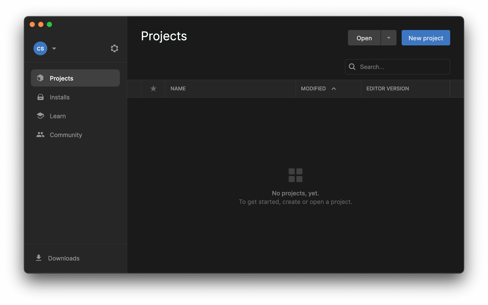
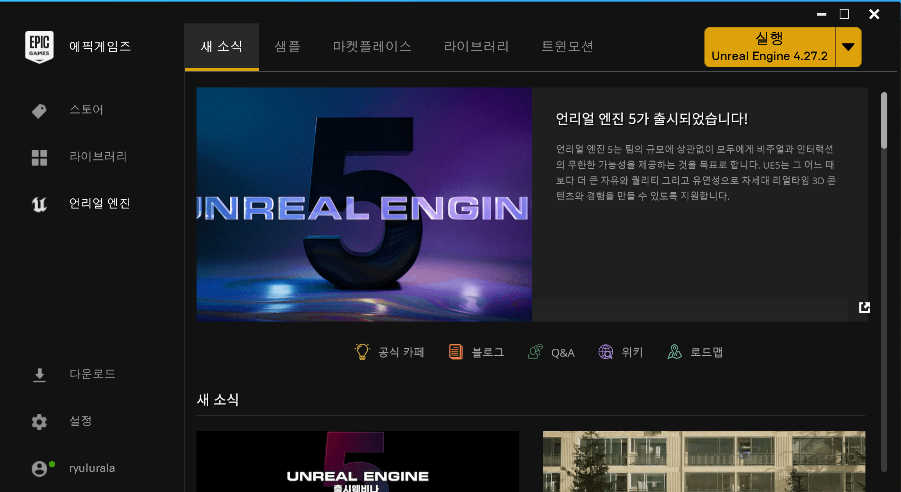
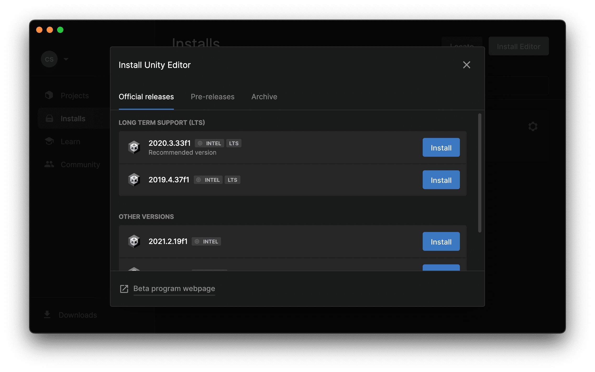

## 언리얼 설치 및 실행

- Unity와 Unreal은 설치와 실행 방법이 비슷하다.
  > Unreal은 Engine Code가 제공되므로 Github에서 엔진 설치가 가능하다.
  >
  > [링크](https://docs.unrealengine.com/4.27/ko/ProgrammingAndScripting/ProgrammingWithCPP/DownloadingSourceCode/)

|                     Unity                     |                     Unreal                      |
| :-------------------------------------------: | :---------------------------------------------: |
|                |          |
|               1. Unity Hub 설치               |           1. Epic games Launcher 설치           |
|  |  |
|        2. 각 버전별 Unity Editor 설치         |         2. 각 버전별 Unreal Engine 설치         |

## 언리얼 환경 설정

### 언리얼 vs 유니티

|                       Unity                        |                                   Unreal                                   |
| :------------------------------------------------: | :------------------------------------------------------------------------: |
| 빈 깡통에서 부품을 맞춰 나감(= 컴포넌트 패턴 구조) |                 태생이 있고 확장시켜나감(= 상속 패턴 구조)                 |
|      엔진이 쓰는 파일들의 삭제, 이름변경 쉬움      | 엔진이 쓰는 파일들의 삭제, 이름변경 어려움(엔진 끄고 탐색기에서 파일 삭제) |
|                                                    |                                                                            |

### 프로젝트 폴더 구조

- `Config`
  > 엔진 행위를 제어하는 값 설정을 하는 환경 설정 파일
  >
  > 나중에 `Engine/Config` 디렉터리에 설정된 값을 덮어씌운다.
- `Content`
  > 게임 에셋, 맵 등의 컨텐츠 파일이 존재
- `Source`
  > `C++` 소스 코드 존재
- `Binaries`: ignore
  > 소스를 통해 만든 실행 파일
- `DerivedDataCache`: ignore
  > 참조된 컨텐츠 캐시 파일이 존재
- `Intermediate`: ignore
  > 게임 빌드 도중 생성된 임시 파일, 게임의 Shader 파일 등 존재
- `Saved`: ignore
  > 자동 저장, 환경 설정(`.ini`), Log 파일들 존재
