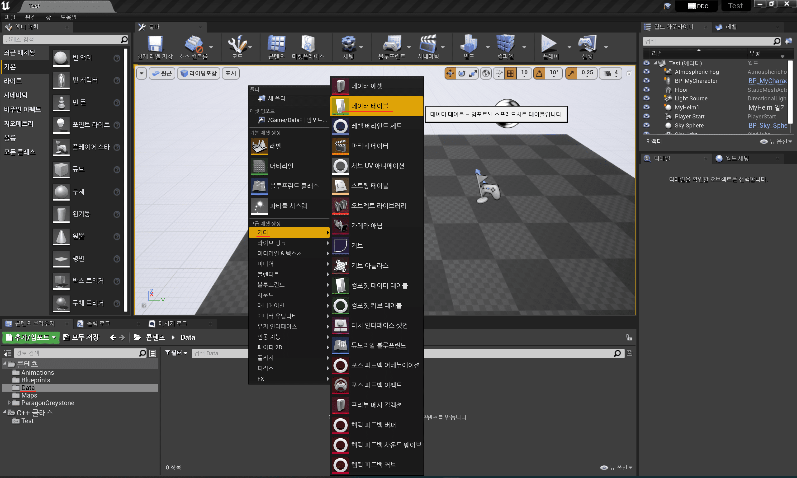
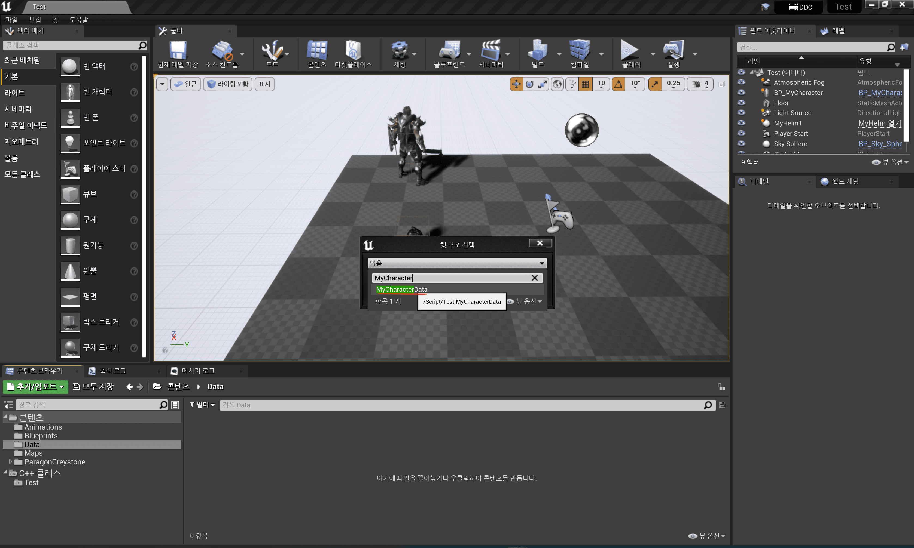
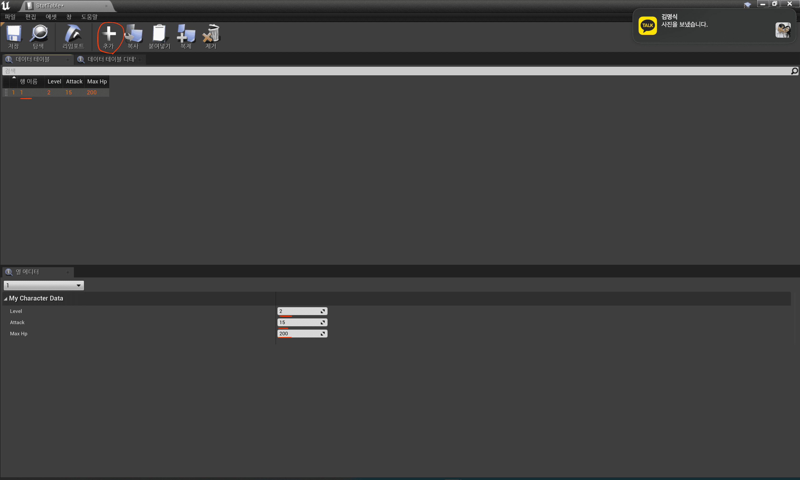
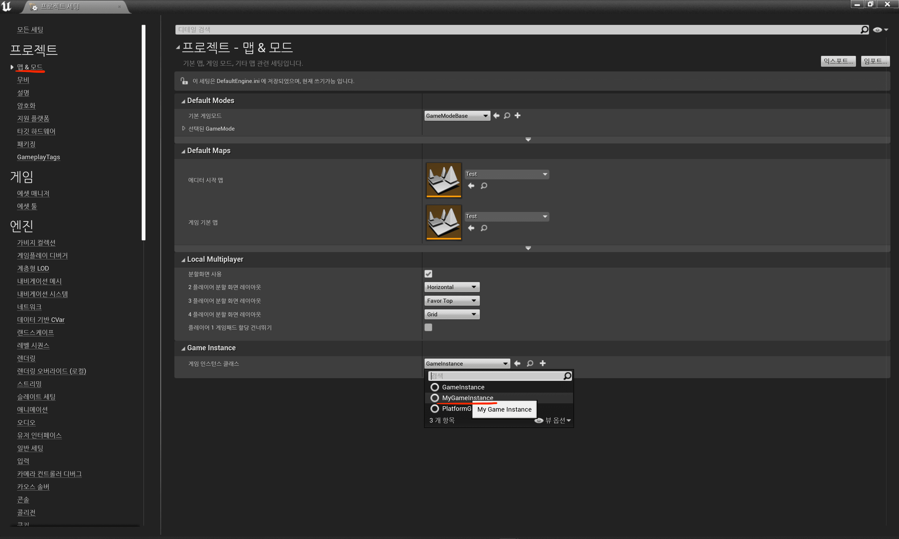
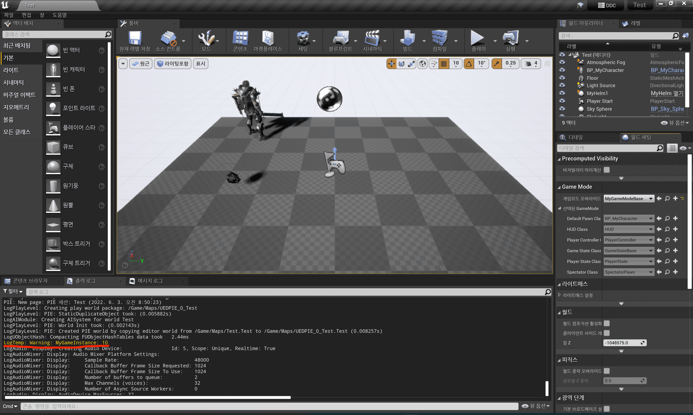
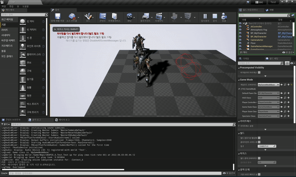

Table of Contents

- [스탯 매니저(Stat Manager)](#스탯-매니저stat-manager)

---

## 스탯 매니저(Stat Manager)

### 데이터 매니저(Data Manager)를 만들어보자

1. MyData 코드 생성

   > Struct 정의만 넣는 용도로, Header만 추가한다.
   >
   > 새로운 C++ 클래스로 "없음"을 클릭하고 cpp가 만들어지면 따로 IDE에서 삭제한다.(헤더만 남김)

   - MyData.h

     ```cpp
     #pragma once

     #include "Engine/DataTable.h"   // generated 전에 선언
     #include "MyData.generated.h"

     USTRUCT()
     struct FMyCharacterData : public FTableRowBase
     {
         GENERATED_USTRUCT_BODY()

         UPROPERTY(EditAnywhere, BlueprintReadWrite)
         int32 Level;

         UPROPERTY(EditAnywhere, BlueprintReadWrite)
         int32 Attack;

         UPROPERTY(EditAnywhere, BlueprintReadWrite)
         int32 MaxHp;
     };

     ```

2. DataTable 생성

   |                 DataTable 생성                  | 행 구조 선택(MyData의 Struct-Data 컴파일 선행 필수!)  |         Data 행 추가          |
   | :---------------------------------------------: | :---------------------------------------------------: | :---------------------------: |
   |  |  |  |

3. GameInstance 생성

   > 게임이 시작되면 한 번만 초기화됨.

   - MyGameInstance.h

     ```cpp
     #pragma once

     #include "CoreMinimal.h"
     #include "Engine/GameInstance.h"
     #include "MyGameInstance.generated.h"

     /**
     *
     */
     UCLASS()
     class TEST_API UMyGameInstance : public UGameInstance
     {
       GENERATED_BODY()

     public:
         UMyGameInstance();

         // 게임이 시작될 때 한 번만 초기화
         virtual void Init() override;

         struct FMyCharacterData* GetStatData(int Level) const;

     private:
         UPROPERTY()
         class UDataTable* MyStats;

     };

     ```

   - MyGameInstance.cpp

     ```cpp
     #include "MyGameInstance.h"

     #include "MyData.h"   // for. FMyCharacterData
     #include "Engine/DataTable.h"   // for. DataTable Function

     UMyGameInstance::UMyGameInstance()
     {
         static ConstructorHelpers::FObjectFinder<UDataTable> STAT_DATA(TEXT("DataTable'/Game/Data/StatTable.StatTable'"));

         //if(STAT_DATA.Succeeded())   // Data가 안 들어오면 Crash를 내는 게 더 적합

         MyStats = STAT_DATA.Object;

     }

     void UMyGameInstance::Init()
     {
         Super::Init();

         // 데이터 로드가 잘 되는지 로깅
         UE_LOG(LogTemp, Warning, TEXT("MyGameInstance: %d"), GetStatData(1)->Attack);
     }

     FMyCharacterData* UMyGameInstance::GetStatData(int Level) const
     {
         return MyStats->FindRow<FMyCharacterData>(*FString::FromInt(Level), TEXT(""));
     }

     ```

4. 게임 인스턴스 변경

   |                  `Project Settings` / `Map & Modes`                   |
   | :-------------------------------------------------------------------: |
   |  |

- 결과

  |     데이터를 로드하고 레벨 1의 공격력 로그 출력     |
  | :-------------------------------------------------: |
  |  |

### 캐릭터가 피격하면 HP가 깎이도록 구현해보자

- A가 B를 공격했을 때, 데미지 처리는 어디서 해야 할까?, A or B?
  > 공격자의 다양한 상황이 존재하기에 대부분은 B(피해자)에서 처리한다.

1. Stat Component 생성

   > Actor Component를 상속

   - MyStatComponent.h

     ```cpp
     #pragma once

     #include "CoreMinimal.h"
     #include "Components/ActorComponent.h"
     #include "MyStatComponent.generated.h"


     UCLASS( ClassGroup=(Custom), meta=(BlueprintSpawnableComponent) )
     class TEST_API UMyStatComponent : public UActorComponent
     {
         GENERATED_BODY()

     public:
         UMyStatComponent();

     protected:
         virtual void BeginPlay() override;
         virtual void InitializeComponent() override;  // 컴포넌트 초기화 시점

     public:
         void SetLevel(int32 NewLevel);
         void OnAttacked(float DamageAmount);

         int32 GetLevel() const { return Level; }
         int32 GetHp() const { return Hp; }
         int32 GetAttack() const { return Attack; }

     private:
         UPROPERTY(EditAnywhere, Category = Stat, Meta = (AllowPrivateAccess = true))
         int32 Level;

         UPROPERTY(EditAnywhere, Category = Stat, Meta = (AllowPrivateAccess = true))
         int32 Hp;

         UPROPERTY(EditAnywhere, Category = Stat, Meta = (AllowPrivateAccess = true))
         int32 Attack;

     };

     ```

   - MyStatComponent.cpp

     ```cpp
     #include "MyStatComponent.h"

     #include "MyGameInstance.h"
     #include "MyData.h"
     #include "Kismet/GameplayStatics.h"   // for. Get GameInstance

     UMyStatComponent::UMyStatComponent()
     {
         PrimaryComponentTick.bCanEverTick = false;    // Tick() 사용하지 않음
         bWantsInitializeComponent = true;   // InitializeComponent() 사용함

         Level = 1;
     }

     void UMyStatComponent::InitializeComponent()
     {
         Super::InitializeComponent();

         SetLevel(Level);;
     }

     void UMyStatComponent::SetLevel(int32 NewLevel)
     {
         auto MyGameInstance = Cast<UMyGameInstance>(UGameplayStatics::GetGameInstance(GetWorld()));
         if (MyGameInstance)
         {
             auto StatData = MyGameInstance->GetStatData(Level);
             if (StatData)
             {
                 Level = StatData->Level;
                 Hp = StatData->MaxHp;
                 Attack = StatData->Attack;
             }
         }
     }

     void UMyStatComponent::OnAttacked(float DamageAmount)
     {
         Hp -= DamageAmount;
         if (Hp < 0)
             Hp = 0;

         UE_LOG(LogTemp, Warning, TEXT("OnAttacked: %d"), Hp);

     }

     ```

2. MyCharacter의 공격했을 경우 처리

   - MyCharacter.h

     ```cpp

     ...

     public:
         ...

         // 가상함수므로 재정의해서 원하는 로직을 실행시킨다.
         virtual float TakeDamage(float DamageAmount, FDamageEvent const& DamageEvent, AController* EventInstigator, AActor* DamageCauser) override;

     private:
         ...

         UPROPERTY(VisibleAnywhere)
         class UMyStatComponent* Stat;

     ...

     ```

   - MyCharacter.cpp

     ```cpp

     ...

     #include "MyStatComponent.h"

     AMyCharacter::AMyCharacter()
     {
         ...

         Stat = CreateDefaultSubobject<UMyStatComponent>(TEXT("STAT"));
     }

     ...

     void AMyCharacter::AttackCheck()
     {
         ...

         if (bResult && HitResult.Actor.IsValid())
         {
             //UE_LOG(LogTemp, Log, TEXT("Hit Actor: %s"), *HitResult.Actor->GetName());

             FDamageEvent DamageEvent;
             HitResult.Actor->TakeDamage(Stat->GetAttack(), DamageEvent, GetController(), this);
         }

         ...
     }

     ...

     float AMyCharacter::TakeDamage(float DamageAmount, FDamageEvent const& DamageEvent, AController* EventInstigator, AActor* DamageCauser)
     {
         Stat->OnAttacked(DamageAmount);

         return DamageAmount;
     }

     ```

- 결과

  |        상대 캐릭터의 HP가 깎이는 로그 출력        |
  | :-----------------------------------------------: |
  |  |

---
