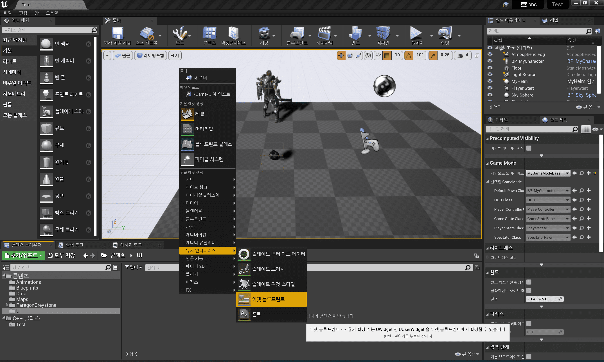
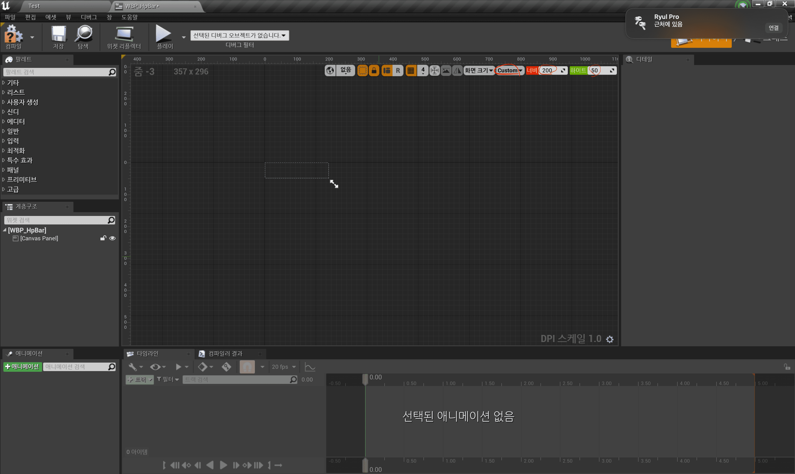
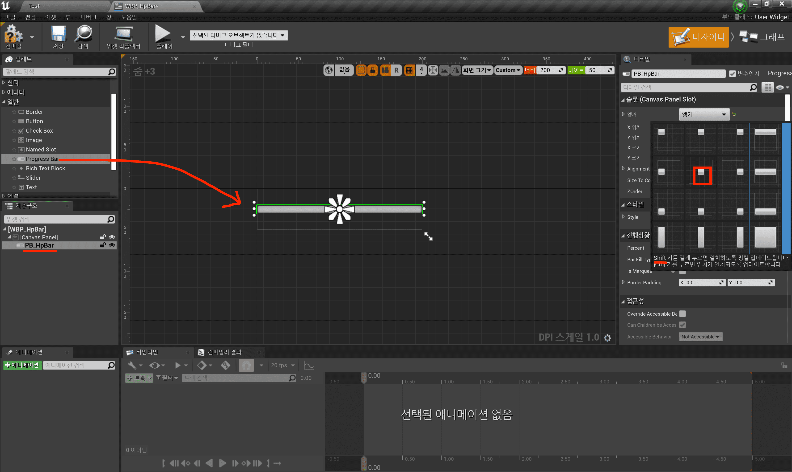
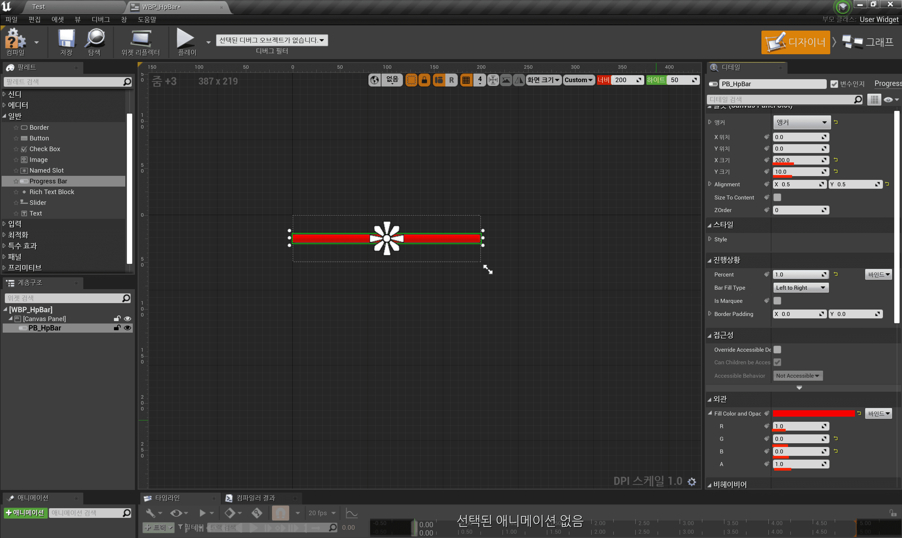
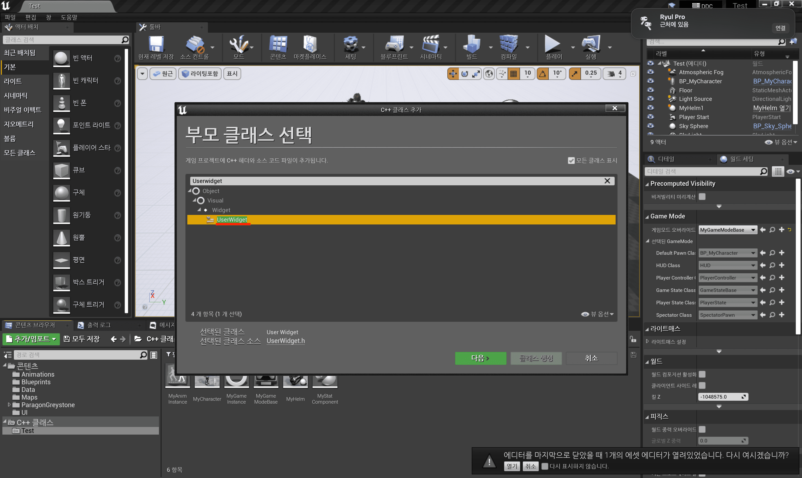
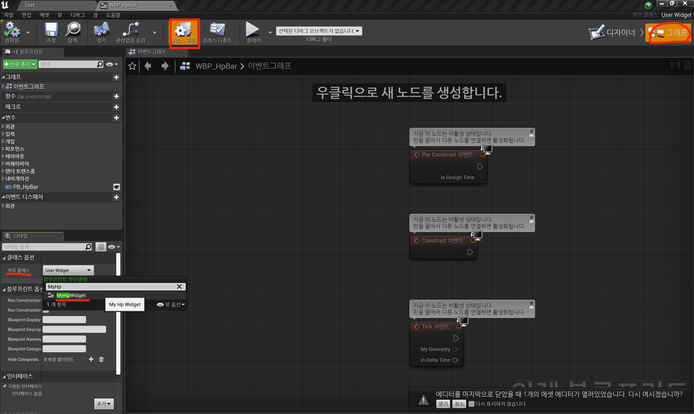
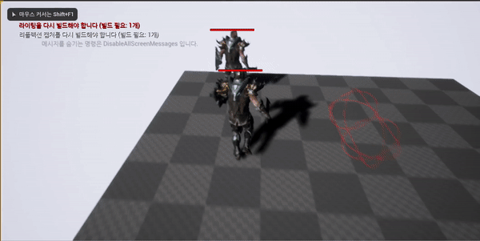

Table of Contents

- [UI 실습](#ui-실습)

---

## UI 실습

- `UMG` 모듈 추가

  - [프로젝트명].Build.cs

    ```cpp
    using UnrealBuildTool;

    public class Test : ModuleRules
    {
        public Test(ReadOnlyTargetRules Target) : base(Target)
        {
            PCHUsage = PCHUsageMode.UseExplicitOrSharedPCHs;

            PublicDependencyModuleNames.AddRange(new string[] { "Core", "CoreUObject", "Engine", "InputCore", "UMG" });   // UMG 추가

            ...
        }
    }

    ```

### 캐릭터의 HP Bar를 만들어보자

1. Widget Blueprint 추가

   - Widget Blueprint 추가

     |                   `UI` / `WBP_HpBar` 추가                   |
     | :---------------------------------------------------------: |
     |  |

   - Progress Bar 추가

     > 이름 짓는 게 매우 중요하다!(for. 이름으로 UI 바인딩)

     |       Custom 으로 Width(200), Height(50) 조절       |     Progress Bar 추가 + 앵커(Shift 누른 채로 가운데)      |          Progress Bar 크기, 색 조절           |
     | :-------------------------------------------------: | :-------------------------------------------------------: | :-------------------------------------------: |
     |  |  |  |

2. MyHpWidget 스크립트 추가

   |          부모 클래스를 `UserWidget`로 하는 `MyHpWidget` 추가          |
   | :-------------------------------------------------------------------: |
   |  |

   - Widget Blueprint의 부모 클래스를 `MyHpWidget`으로 지정

     > cpp 스크립트트에서 로직을 만들고 이를 상속받는 위젯 블루프린트에서 디자인을 하는 방식으로 많이 쓰인다.
     >
     > HpWidget(Cpp) + HpWidget(Blueprint)

     |   `그래프` - `클래스 세팅` - `부모 클래스`    |
     | :-------------------------------------------: |
     |  |

   - MyHpWidget.h

     ```cpp
     #pragma once

     #include "CoreMinimal.h"
     #include "Blueprint/UserWidget.h"
     #include "MyHpWidget.generated.h"

     /**
     *
     */
     class UMyStatComponent;   // 전방 선언

     UCLASS()
     class TEST_API UMyHpWidget : public UUserWidget
     {
         GENERATED_BODY()

     public:
         void BindHp(UMyStatComponent* StatComp);

         void UpdateHp();

     private:
         // 수명주기가 다른 컴포넌트를 들 때는 혹시 모르니 WeakPtr를 사용
         TWeakObjectPtr<UMyStatComponent> CurrentStatComp;

         UPROPERTY(meta=(BindWidget))  // 이름 바인딩
         class UProgressBar* PB_HpBar;

         // 이름이 달라도 바인딩 가능
         // PB_HpBar = Cast<UProgressBar>(GetWidgetFromName(TEXT("PB_HpBar")))
     };

     ```

   - MyHpWidget.h

     ```cpp
     #include "MyHpWidget.h"

     #include "MyStatComponent.h"
     #include "Components/ProgressBar.h"

     void UMyHpWidget::BindHp(UMyStatComponent* StatComp)
     {
         CurrentStatComp = StatComp;
         StatComp->OnHpChanged.AddUObject(this, &UMyHpWidget::UpdateHp);
     }

     void UMyHpWidget::UpdateHp()
     {
         if (CurrentStatComp.IsValid())
             PB_HpBar->SetPercent(CurrentStatComp->GetHpRatio());
     }

     ```

3. MyCharacter에 UWidgetComponent 추가 + 바인딩

   - MyCharacter.h

     ```cpp

     ...

     public:
         ...

         UPROPERTY(VisibleAnywhere)
         class UWidgetComponent* HpBar;

     ...

     ```

   - MyCharacter.cpp

     ```cpp

     ...

     #include "MyStatComponent.h"
     #include "Components/WidgetComponent.h"
     #include "MyHpWidget.h"

     AMyCharacter::AMyCharacter()
     {
         ...

         HpBar = CreateDefaultSubobject<UWidgetComponent>(TEXT("HPBAR"));
         HpBar->SetupAttachment(GetMesh());    // Attach Mesh
         HpBar->SetRelativeLocation(FVector(0.0f, 0.0f, 200.0f));  // 캐릭터 위에 표시
         HpBar->SetWidgetSpace(EWidgetSpace::Screen);  // Screen: never occluded

         static ConstructorHelpers::FClassFinder<UUserWidget> WBP_HPBAR(TEXT("WidgetBlueprint'/Game/UI/WBP_HpBar.WBP_HpBar_C'"));
         if (WBP_HPBAR.Succeeded())
         {
             HpBar->SetWidgetClass(WBP_HPBAR.Class);
             HpBar->SetDrawSize(FVector2D(200.0f, 50.0f));
         }
     }

     void AMyCharacter::PostInitializeComponents()
     {
         ...

         // 초기화 보장
         HpBar->InitWidget();

         // Delegate Binding
         auto HpWidget = Cast<UMyHpWidget>(HpBar->GetUserWidgetObject());
         if (HpWidget)
             HpWidget->BindHp(Stat);
     }

     ```

- 결과

  |    Damage를 받으면 Hp가 깎이는 UI     |
  | :-----------------------------------: |
  |  |

---
