## 언리얼 엔진 기초

### 에디터 인터페이스

|           Default Editor Interface            |
| :-------------------------------------------: |
| 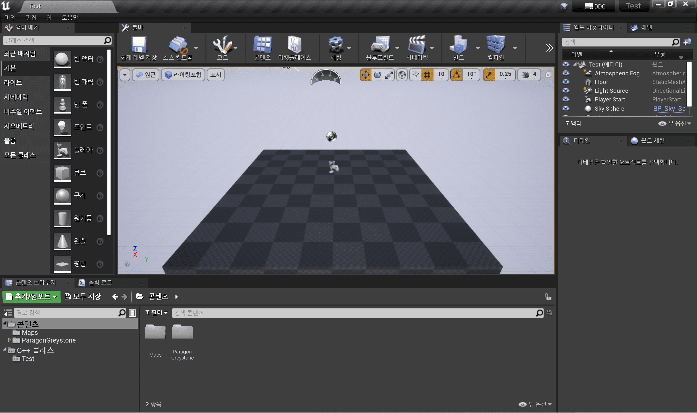 |

- 액터 배치: Modes
  > 엔진 자체에서 제공하고, 작업 목적에 따라 배치할 수 있는 것들이 있는 영역
  >
  > 주로, Geometry, NaviMesh Volume, Lights 등을 사용
  - Unity: Pro-builder
- 툴바: Toolbar
  > 자주 사용되는 기능들이 모여있는 영역
  >
  > Play, Build, Project Settings 등 사용
- 뷰포트: Viewport
  > 에디터 내에서 구현된 3D 월드를 본다.
  - Unity: Scene View, Game View
- 월드 아웃라이너: World Outliner
  > 레벨(맵) 안에 존재하는 모든 오브젝트를 계층 구조로 나타낸 영역
  - Unity: Hierarchy
- 디테일: Detail
  > 월드 아웃라이너에서 선택한 오브젝트에 대한 자세한 정보를 보여줌
  - Unity: Inspector
- 콘텐츠 브라우저: Content Browser
  > 에디터 안에서 콘텐츠 애셋을 만들고 불러오고 수정하고 확인하는데 사용하는 영역
  - Unity: Project

---

## 언리얼 vs 유니티

|                         Unity                          |                                   Unreal                                   |
| :----------------------------------------------------: | :------------------------------------------------------------------------: |
| 빈 깡통에서 부품을 추가하는 방식(= 컴포넌트 패턴 구조) |                태생이 있고 확장하는 방식(= 상속 패턴 구조)                 |
|        엔진이 쓰는 파일들의 삭제, 이름변경 쉬움        | 엔진이 쓰는 파일들의 삭제, 이름변경 어려움(엔진 끄고 탐색기에서 파일 삭제) |
|        카메라 (컴포넌트가 붙은) 오브젝트가 존재        | Default Pawn으로 해서 기본 플레이어 생성 후 카메라가 Default Pawn을 따라감 |

### 실습: 의자를 하나 만들어보자

1. Actor 생성

   > `Actor`: 월드에 배치 or 스폰 가능한 `Object`(를 상속)

   |    C++ 폴더 클릭 -> 오른쪽 마우스 클릭    |                Actor 선택                 |         이름 설정 후 클래스 생성          |
   | :---------------------------------------: | :---------------------------------------: | :---------------------------------------: |
   | 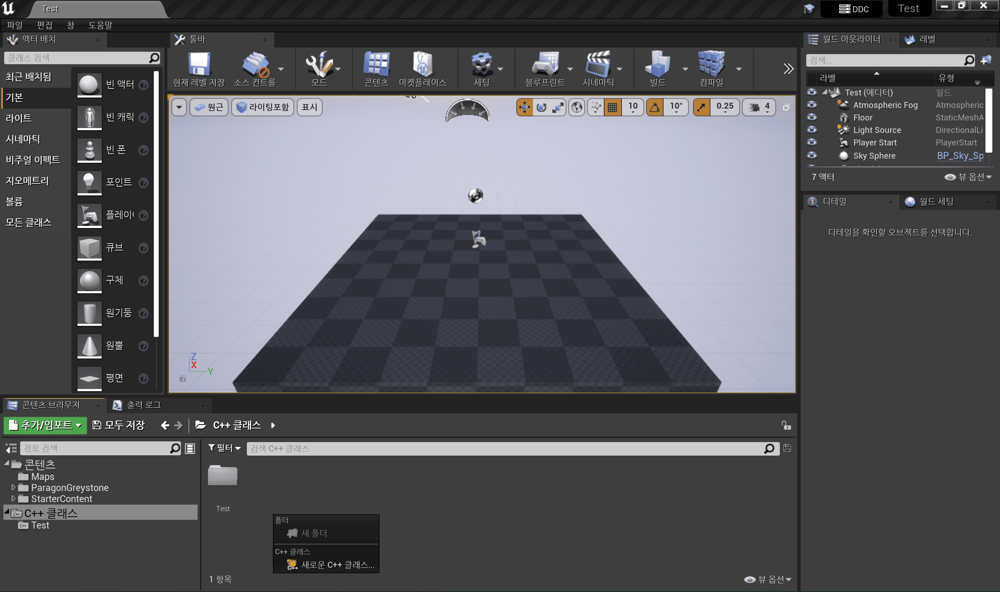 | 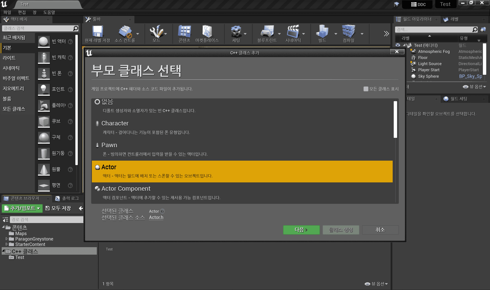 | 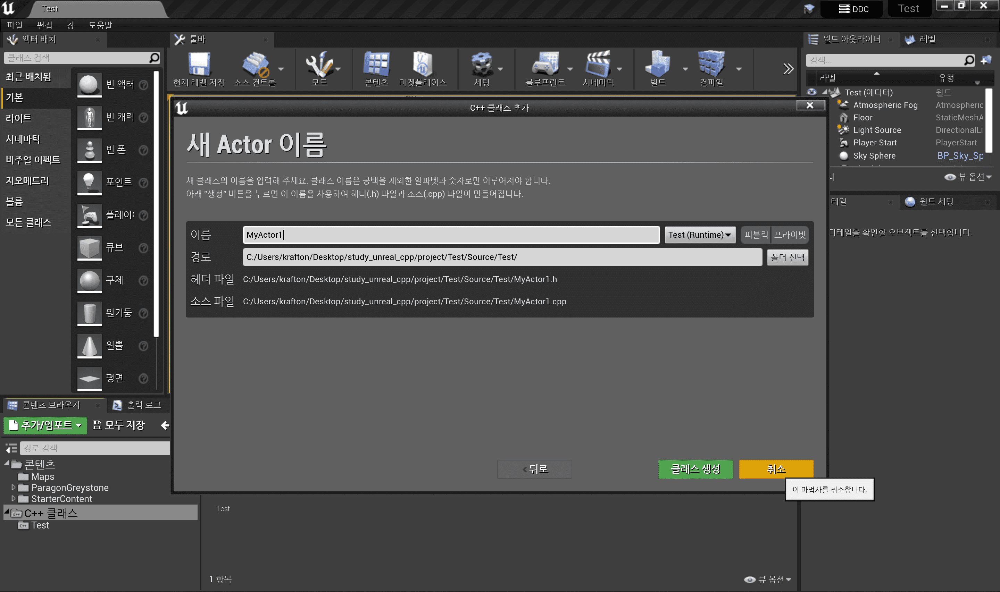 |

2. Mesh Component 추가

   - MyActor.h

     ```cpp
     #pragma once    // 순환 참조 방지

     #include "CoreMinimal.h"
     #include "GameFramework/Actor.h"
     #include "MyActor.generated.h"

     UCLASS()    // 언리얼 오브젝트라는 것을 알려주는 매크로
     class TEST_API AMyActor : public AActor   // 상속 구조
     {
         GENERATED_BODY()

     public:
         AMyActor();     // 생성자: 변수들 디폴트 설정

     protected:
         virtual void BeginPlay() override;    // 월드에 스폰 후 실행되는 함수

     public:
         virtual void Tick(float DeltaTime) override;    // 매 프레임마다 호출되는 함수

     private:
         // for. 리플렉션(Reflection)/
         // VisibleAnywhere: 에디터 내에서 보임(몇몇 오브젝트는 수정도 가능)
         UPROPERTY(VisibleAnywhere)
         UStaticMeshComponent* Mesh;   // 월드에서 보여질 Mesh
     };
     ```

   - MyActor.cpp

     ```cpp
     #include "MyActor.h"

     AMyActor::AMyActor()
     {
         PrimaryActorTick.bCanEverTick = true;

         // Reflection으로 관리되는 프로퍼티
         // New로 생성되지 않는다. -> 언리얼에서 메모리 자동 관리
         // TEXT(): 크로스 플랫폼으로 사용 가능(인코딩 문제 해결)
         Mesh = CreateDefaultSubobject<UStaticMeshComponent>(TEXT("MESH"));   // New
     }

     ...

     ```

3. Mesh 로드

   |   메시 오른쪽 클릭 + 레퍼런스 경로 복사   |       단축키로 경로 복사       |
   | :---------------------------------------: | :----------------------------: |
   | 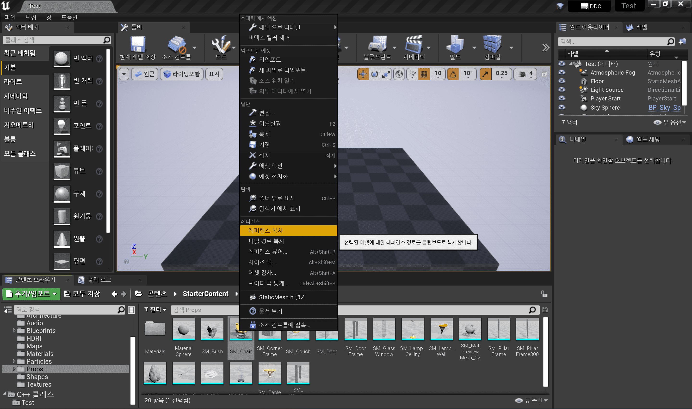 | 의자 메시 클릭 후 `Ctrl` + `C` |

   - MyActor.cpp

     ```cpp
     #include "MyActor.h"

     AMyActor::AMyActor()
     {
         PrimaryActorTick.bCanEverTick = true;

         Mesh = CreateDefaultSubobject<UStaticMeshComponent>(TEXT("MESH"));   // New

         ConstructorHelpers::FObjectFinder<UStaticMesh> SM_Chair(TEXT("StaticMesh'/Game/StarterContent/Props/SM_Chair.SM_Chair'"));   // Mesh 로드, TEXT("<경로>");
         if (SM_CHAIR.Succeeded())
         {
           // 로드 성공할 경우 메시 세팅
           Mesh->SetStaticMesh(SM_CHAIR.Object);
         }
     }

     ...

     ```

4. 에디터 컴파일 or 소스코드 빌드

   - 소스코드 내용을 에디터에 반영한다.
     > Hot Reload: 상태를 잃지 않고 변경된 것에 한해 파일을 새로 고침(dll 등)

   |               에디터 컴파일               |                  소스코드 빌드                  |
   | :---------------------------------------: | :---------------------------------------------: |
   | 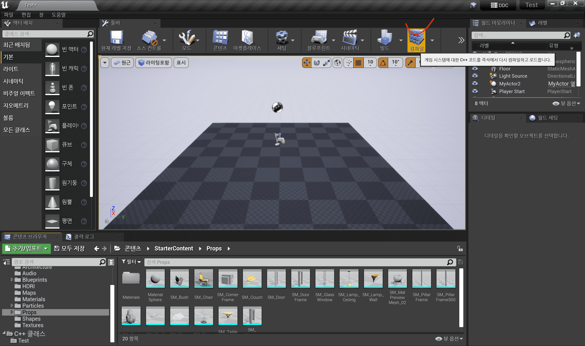 | 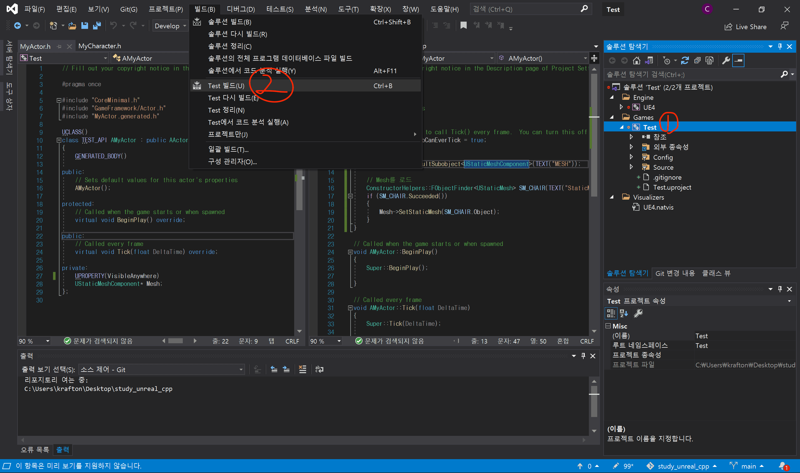 |

5. 해당 Actor에 가져온 Mesh 확인

   |                       결과                        |
   | :-----------------------------------------------: |
   | 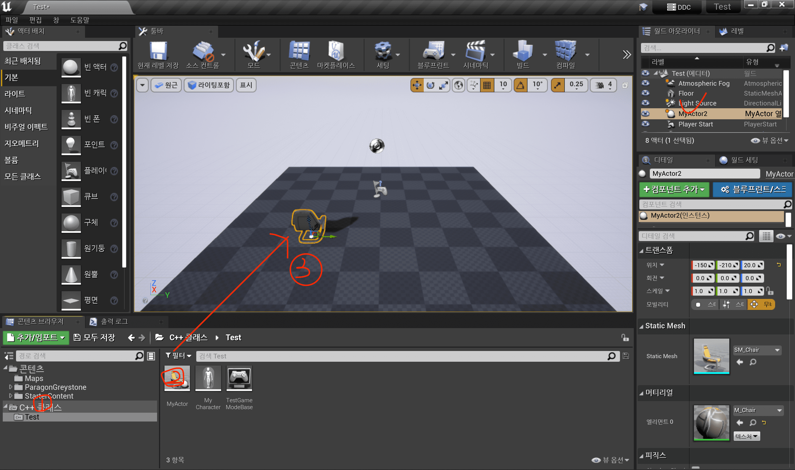 |

---

## Log & Debug

### 실습: 로그 출력해보자

1. MyActor에 로그 출력 코드 작성

   - MyActor.cpp

     ```cpp
     // 액터가 월드에 스폰되고 호출
     void AMyActor::BeginPlay()
     {
         Super::BeginPlay();   // 상속 구조로 부모 함수 호출

         // 카테고리: LogTemp
         // 로깅 수준: Warning(노란색)
         // 형식: TEXT("BeginPlay: %d")
         // 인자: 3
         UE_Log(LogTemp, Warning, TEXT("BeginPlay %d"), 3);
     }

     // 매 프레임마다 호출
     void AMyActor::Tick(float DeltaTime)
     {
         Super::Tick(DeltaTime);   // 상속 구조로 부모 함수 호출

         // 카테고리: LogTemp
         // 로깅 수준: Error(빨간색)
         // 형식: TEXT("Tick: %f")
         // 인자: DeltaTime(이전 프레임과의 시간 간격)
         UE_LOG(LogTemp, Error, TEXT("Tick: %f"), DeltaTime);
     }
     ```

2. 에디터 컴파일 또는 소스코드를 빌드

   - 소스코드 내용을 에디터에 반영한다.
     > Hot Reload: 상태를 잃지 않고 변경된 것에 한해 파일을 새로 고침(dll 등)

   |               에디터 컴파일               |            소스코드 빌드(`Ctrl`+`B`)            |
   | :---------------------------------------: | :---------------------------------------------: |
   |  |  |

3. 에디터 콘솔 or 파일로 결과 확인

   |                                            에디터 콘솔                                            |            파일(`Saved`-`Logs`)             |
   | :-----------------------------------------------------------------------------------------------: | :-----------------------------------------: |
   | 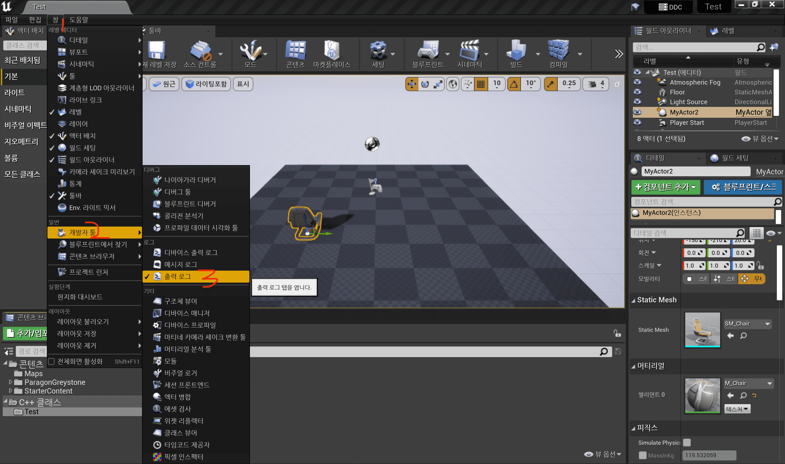 - 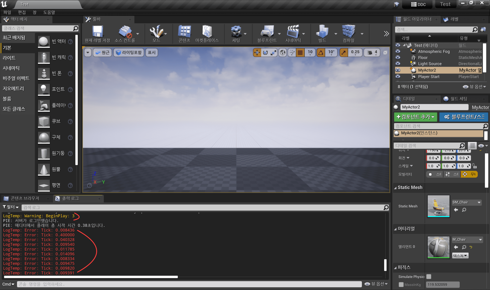 | 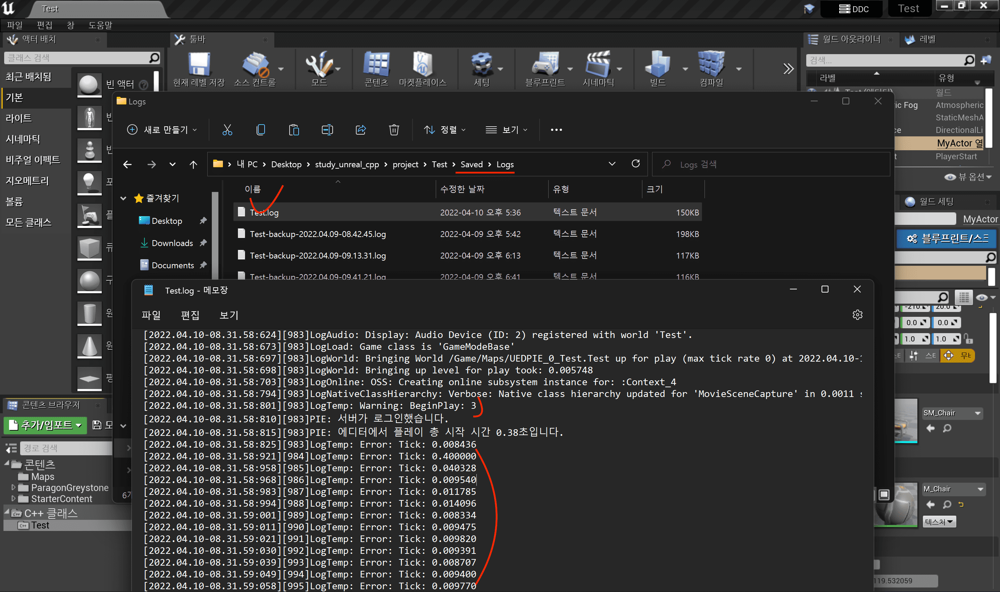 |

### 실습: 디버깅 해보자

- (중단점을 걸고) 디버깅을 해보려면 에디터를 끄고 해야 한다.
- Binary 폴더에 exe 파일 결과가 나온다.

|         디버그 모드 종류          |
| :-------------------------------: |
| 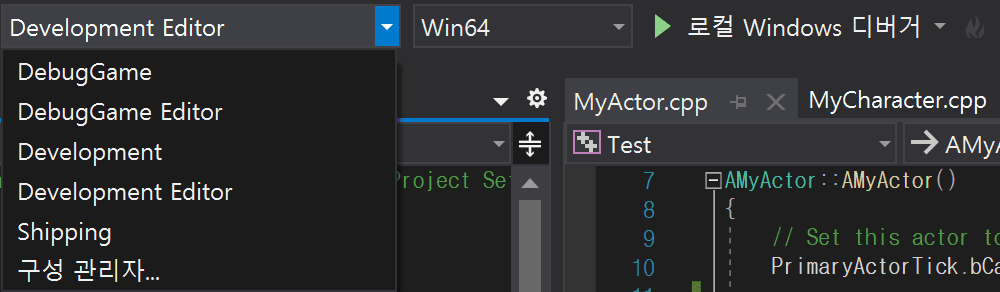 |

|                   DebugGame                    |                DebugGame Editor                |        Development         |              Development Editor               |      Shipping       |
| :--------------------------------------------: | :--------------------------------------------: | :------------------------: | :-------------------------------------------: | :-----------------: |
|                   Debug 모드                   |            Debug 모드 + Editor 시작            |        Release 모드        |          Release 모드 + Editor 시작           | 최종 제품 배포 모드 |
| 아트 리소스가 패키징 안된다. -> 에러 발생 가능 | Debug + DLL을 만들어 Editor 위에서 실행 가능함 | Debug 보다는 최적화된 상태 | Development + DLL을 만들어 Editor 위에서 실행 |                     |

1. 중단점 추가

   | 해당 줄에서 `F9` 입력 or 중단점 영역에서 추가 |
   | :-------------------------------------------: |
   |       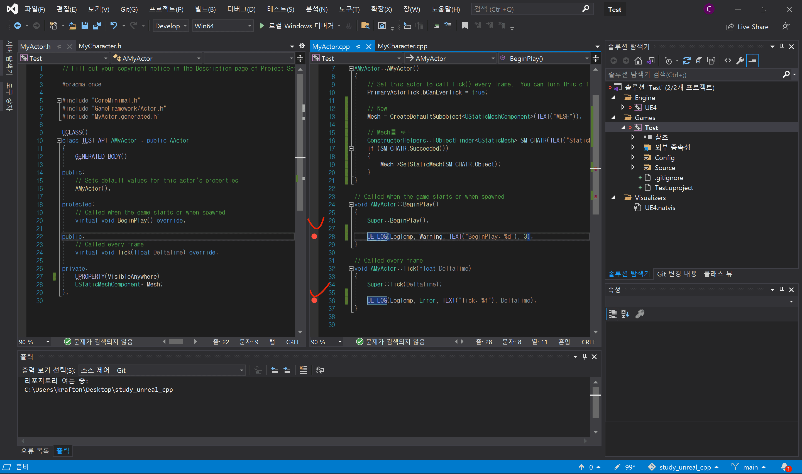       |

2. 언리얼 에디터를 끄고 디버깅 시작

   - 최적화 여부에 따라 디버그 모드 다르게 시작

   |                       `DebugGame Editor`로 시작                       |                        `Development Editor`로 시작                        |
   | :-------------------------------------------------------------------: | :-----------------------------------------------------------------------: |
   | 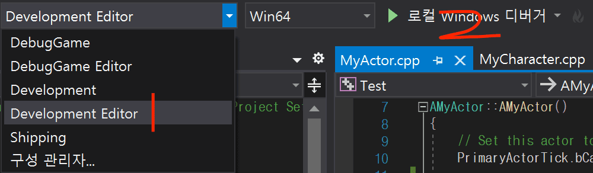 | 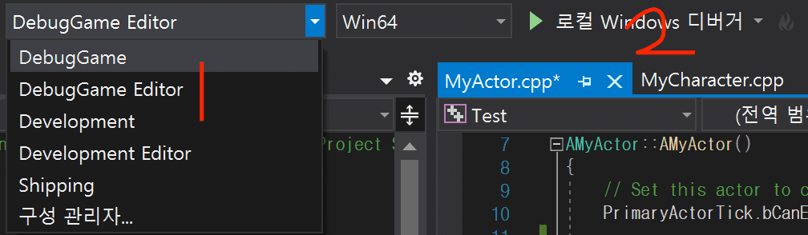 |

   | 에디터가 실행되고 걸어놓은 중단점에서 에디터 진행이 멈춤 |
   | :------------------------------------------------------: |
   |          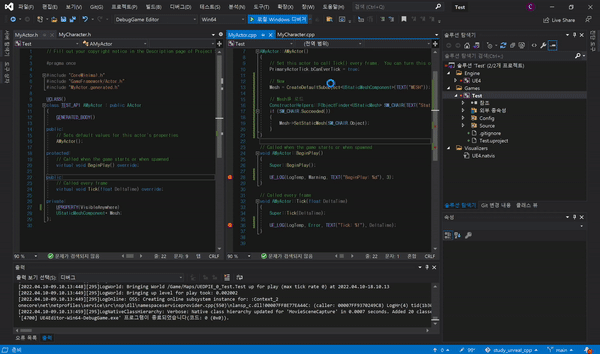           |

   - 디버그 모드가 중지되면 에디터도 동시에 꺼짐

### 실습: 의자를 회전해보자

1. Actor 생성
2. Static Mesh 컴포넌트 추가
3. Tick() 작성
   > FRotator 이용

---
