Table of Contents

- [언리얼 엔진 기초](#언리얼-엔진-기초)
- [언리얼 vs 유니티](#언리얼-vs-유니티)
- [Log & Debug](#log--debug)
- [게임플레이 프레임워크](#게임플레이-프레임워크)
- [캐릭터 생성](#캐릭터-생성)
- [블루프린트 클래스](#블루프린트-클래스)

---

## 언리얼 엔진 기초

### 에디터 인터페이스

|           Default Editor Interface            |
| :-------------------------------------------: |
|  |

- 액터 배치: Modes
  > 엔진 자체에서 제공하고, 작업 목적에 따라 배치할 수 있는 것들이 있는 영역
  >
  > 주로, Geometry, NaviMesh Volume, Lights 등을 사용
  - Unity: Pro-builder
- 툴바: Toolbar
  > 자주 사용되는 기능들이 모여있는 영역
  >
  > Play, Build, Project Settings 등 사용
- 뷰포트: Viewport
  > 에디터 내에서 구현된 3D 월드를 본다.
  - Unity: Scene View, Game View
- 월드 아웃라이너: World Outliner
  > 레벨(맵) 안에 존재하는 모든 오브젝트를 계층 구조로 나타낸 영역
  - Unity: Hierarchy
- 디테일: Detail
  > 월드 아웃라이너에서 선택한 오브젝트에 대한 자세한 정보를 보여줌
  - Unity: Inspector
- 콘텐츠 브라우저: Content Browser
  > 에디터 안에서 콘텐츠 애셋을 만들고 불러오고 수정하고 확인하는데 사용하는 영역
  - Unity: Project

---

## 언리얼 vs 유니티

|                         Unity                          |                                   Unreal                                   |
| :----------------------------------------------------: | :------------------------------------------------------------------------: |
| 빈 깡통에서 부품을 추가하는 방식(= 컴포넌트 패턴 구조) |                태생이 있고 확장하는 방식(= 상속 패턴 구조)                 |
|        엔진이 쓰는 파일들의 삭제, 이름변경 쉬움        | 엔진이 쓰는 파일들의 삭제, 이름변경 어려움(엔진 끄고 탐색기에서 파일 삭제) |
|        카메라 (컴포넌트가 붙은) 오브젝트가 존재        | Default Pawn으로 해서 기본 플레이어 생성 후 카메라가 Default Pawn을 따라감 |

### 실습: 의자를 하나 만들어보자

1. Actor 생성

   > `Actor`: 월드에 배치 or 스폰 가능한 `Object`(를 상속)

   |    C++ 폴더 클릭 -> 오른쪽 마우스 클릭    |                Actor 선택                 |         이름 설정 후 클래스 생성          |
   | :---------------------------------------: | :---------------------------------------: | :---------------------------------------: |
   | 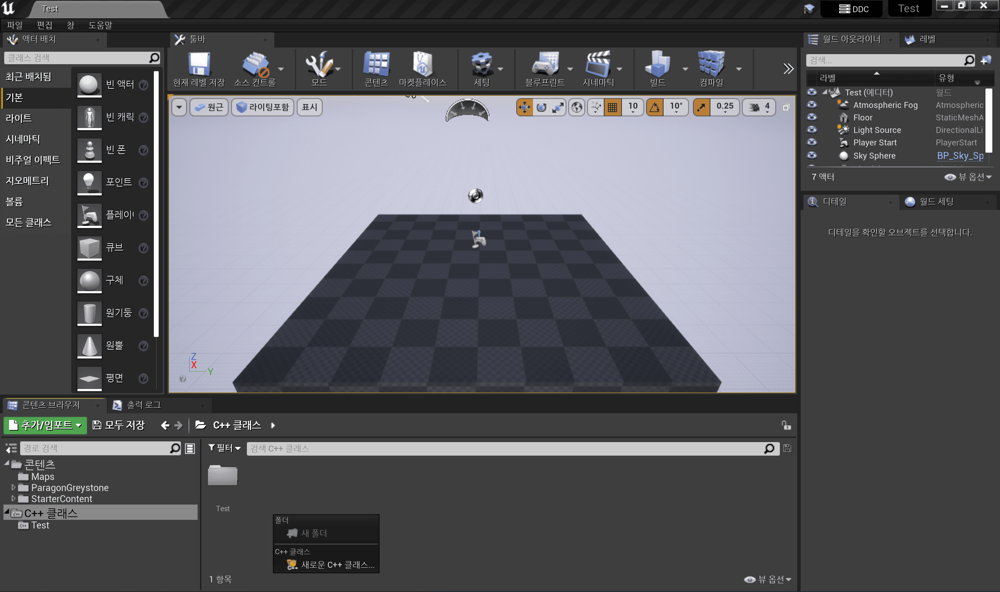 |  |  |

2. Mesh Component 추가

   - MyActor.h

     ```cpp
     #pragma once    // 순환 참조 방지

     #include "CoreMinimal.h"
     #include "GameFramework/Actor.h"
     #include "MyActor.generated.h"

     UCLASS()    // 언리얼 오브젝트라는 것을 알려주는 매크로
     class TEST_API AMyActor : public AActor   // 상속 구조
     {
         GENERATED_BODY()

     public:
         AMyActor();     // 생성자: 변수들 디폴트 설정

     protected:
         virtual void BeginPlay() override;    // 월드에 스폰 후 실행되는 함수

     public:
         virtual void Tick(float DeltaTime) override;    // 매 프레임마다 호출되는 함수

     private:
         // for. 리플렉션(Reflection)/
         // VisibleAnywhere: 에디터 내에서 보임(몇몇 오브젝트는 수정도 가능)
         UPROPERTY(VisibleAnywhere)
         UStaticMeshComponent* Mesh;   // 월드에서 보여질 Mesh
     };
     ```

   - MyActor.cpp

     ```cpp
     #include "MyActor.h"

     AMyActor::AMyActor()
     {
         PrimaryActorTick.bCanEverTick = true;

         // Reflection으로 관리되는 프로퍼티
         // New로 생성되지 않는다. -> 언리얼에서 메모리 자동 관리
         // TEXT(): 크로스 플랫폼으로 사용 가능(인코딩 문제 해결)
         Mesh = CreateDefaultSubobject<UStaticMeshComponent>(TEXT("MESH"));   // New
     }

     ...

     ```

3. Mesh 로드

   |   메시 오른쪽 클릭 + 레퍼런스 경로 복사   |       단축키로 경로 복사       |
   | :---------------------------------------: | :----------------------------: |
   |  | 의자 메시 클릭 후 `Ctrl` + `C` |

   - MyActor.cpp

     ```cpp
     #include "MyActor.h"

     AMyActor::AMyActor()
     {
         PrimaryActorTick.bCanEverTick = true;

         Mesh = CreateDefaultSubobject<UStaticMeshComponent>(TEXT("MESH"));   // New

         ConstructorHelpers::FObjectFinder<UStaticMesh> SM_Chair(TEXT("StaticMesh'/Game/StarterContent/Props/SM_Chair.SM_Chair'"));   // Mesh 로드, TEXT("<경로>");
         if (SM_CHAIR.Succeeded())
         {
           // 로드 성공할 경우 메시 세팅
           Mesh->SetStaticMesh(SM_CHAIR.Object);
         }
     }

     ...

     ```

4. 에디터 컴파일 or 소스코드 빌드

   - 소스코드 내용을 에디터에 반영한다.
     > Hot Reload: 상태를 잃지 않고 변경된 것에 한해 파일을 새로 고침(dll 등)

   |               에디터 컴파일               |                  소스코드 빌드                  |
   | :---------------------------------------: | :---------------------------------------------: |
   | 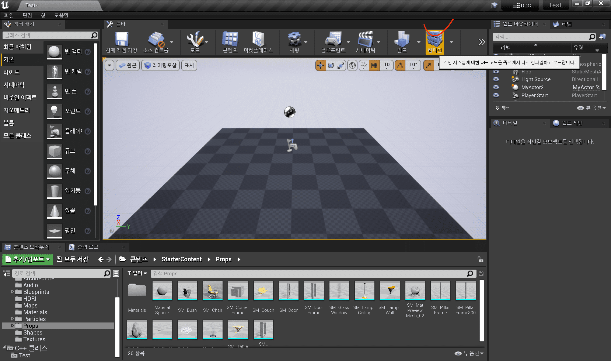 | 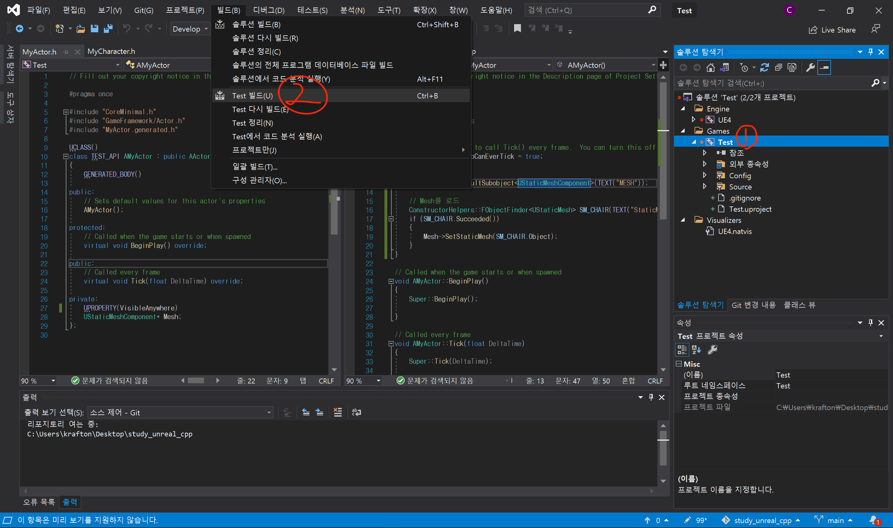 |

5. 해당 Actor에 가져온 Mesh 확인

   |                       결과                        |
   | :-----------------------------------------------: |
   | 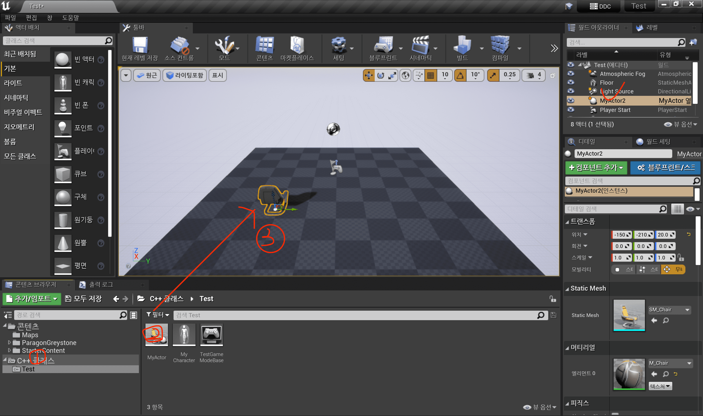 |

---

## Log & Debug

### 실습: 로그 출력해보자

1. MyActor에 로그 출력 코드 작성

   - MyActor.cpp

     ```cpp
     // 액터가 월드에 스폰되고 호출
     void AMyActor::BeginPlay()
     {
         Super::BeginPlay();   // 상속 구조로 부모 함수 호출

         // 카테고리: LogTemp
         // 로깅 수준: Warning(노란색)
         // 형식: TEXT("BeginPlay: %d")
         // 인자: 3
         UE_Log(LogTemp, Warning, TEXT("BeginPlay %d"), 3);
     }

     // 매 프레임마다 호출
     void AMyActor::Tick(float DeltaTime)
     {
         Super::Tick(DeltaTime);   // 상속 구조로 부모 함수 호출

         // 카테고리: LogTemp
         // 로깅 수준: Error(빨간색)
         // 형식: TEXT("Tick: %f")
         // 인자: DeltaTime(이전 프레임과의 시간 간격)
         UE_LOG(LogTemp, Error, TEXT("Tick: %f"), DeltaTime);
     }
     ```

2. 에디터 컴파일 또는 소스코드를 빌드

   - 소스코드 내용을 에디터에 반영한다.
     > Hot Reload: 상태를 잃지 않고 변경된 것에 한해 파일을 새로 고침(dll 등)

   |               에디터 컴파일               |            소스코드 빌드(`Ctrl`+`B`)            |
   | :---------------------------------------: | :---------------------------------------------: |
   |  |  |

3. 에디터 콘솔 or 파일로 결과 확인

   |                                            에디터 콘솔                                            |            파일(`Saved`-`Logs`)             |
   | :-----------------------------------------------------------------------------------------------: | :-----------------------------------------: |
   | 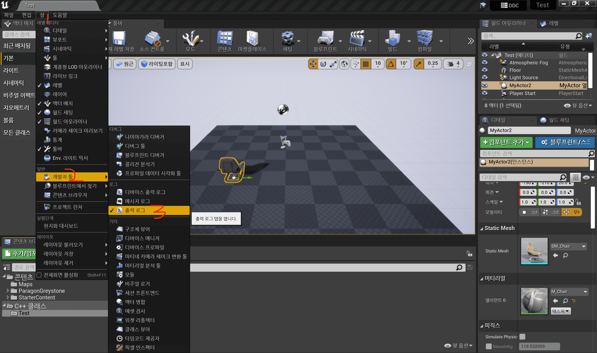 - 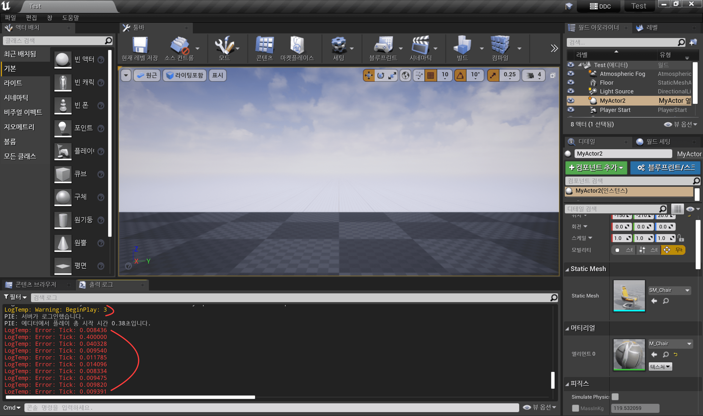 | 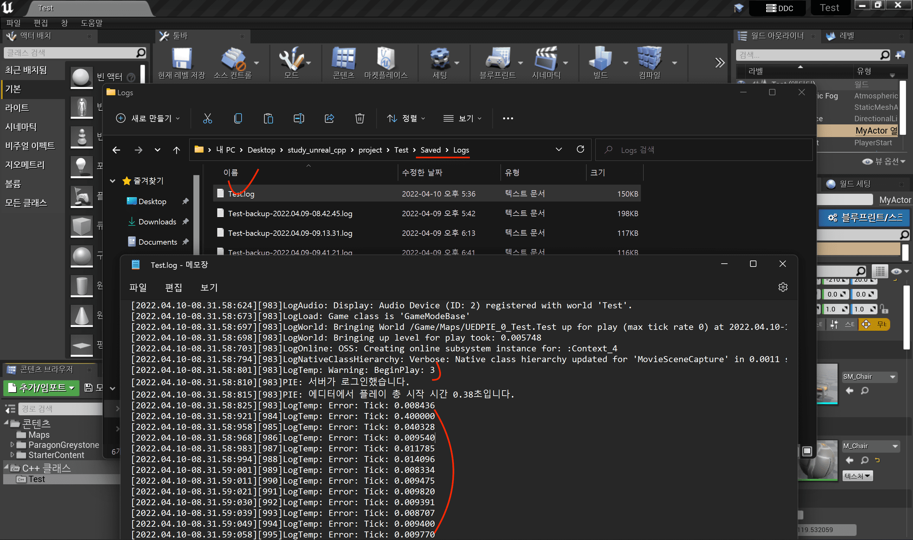 |

### 실습: 디버깅 해보자

- (중단점을 걸고) 디버깅을 해보려면 에디터를 끄고 해야 한다.
- Binary 폴더에 exe 파일 결과가 나온다.

|         디버그 모드 종류          |
| :-------------------------------: |
| 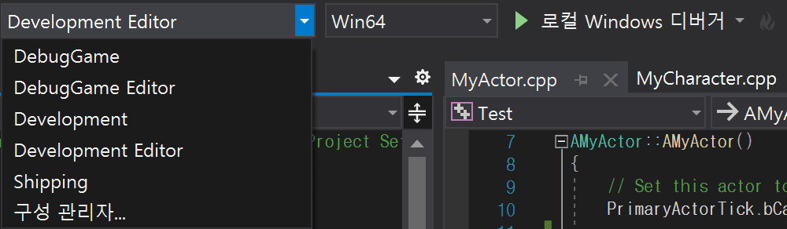 |

|                           DebugGame                           |                DebugGame Editor                |        Development         |              Development Editor               |      Shipping       |
| :-----------------------------------------------------------: | :--------------------------------------------: | :------------------------: | :-------------------------------------------: | :-----------------: |
|                          Debug 모드                           |            Debug 모드 + Editor 시작            |        Release 모드        |          Release 모드 + Editor 시작           | 최종 제품 배포 모드 |
| 아트 리소스가 패키징 안된다. -> 따로 패키징 경로를 제공해야함 | Debug + DLL을 만들어 Editor 위에서 실행 가능함 | Debug 보다는 최적화된 상태 | Development + DLL을 만들어 Editor 위에서 실행 |                     |

1. 중단점 추가

   | 해당 줄에서 `F9` 입력 or 중단점 영역에서 추가 |
   | :-------------------------------------------: |
   |              |

2. 언리얼 에디터를 끄고 디버깅 시작

   - 최적화 여부에 따라 디버그 모드 다르게 시작

   |                       `DebugGame Editor`로 시작                       |                        `Development Editor`로 시작                        |
   | :-------------------------------------------------------------------: | :-----------------------------------------------------------------------: |
   | 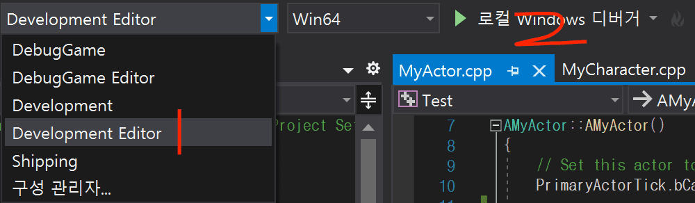 | 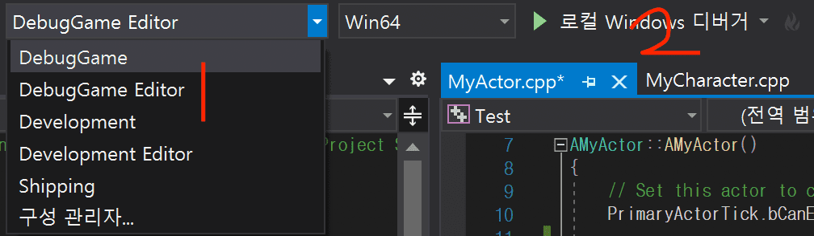 |

   | 에디터가 실행되고 걸어놓은 중단점에서 에디터 진행이 멈춤 |
   | :------------------------------------------------------: |
   |          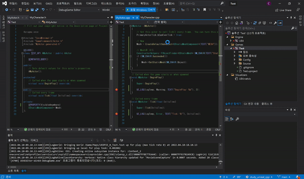           |

   - 디버그 모드가 중지되면 에디터도 동시에 꺼짐

### 실습: 의자를 회전해보자

1. `Tick()`에 코드 작성

   - `MyActor.h`

     ```cpp
     ...

     private:
         UPROPERTY(EditAnywhere)
         float RotateSpeed = 30.f;    // 회전 속도
     ```

   - `MyActor.cpp`

     ```cpp
     ...

     void AMyActor::Tick(float DeltaTime)
     {
         Super::Tick(DeltaTime);

         // 인자: FRotator를 이용(or Quaternion 이용 가능)
         // FRotator(Pitch, Yaw, Roll)
         // Pitch(Y), Yaw(Z), Roll(X)

         AddActorLocalRotation(FRotator(RotateSpeed * DeltaTime, 0.f, 0.f));  // Pitch(Y) 회전
         // AddActorLocalRotation(FRotator(0.f, RotateSpeed * DeltaTime, 0.f));  // Yaw(Z) 회전
         // AddActorLocalRotation(FRotator(0.f, 0.f, RotateSpeed * DeltaTime));  // Roll(X) 회전
     }
     ```

2. Hot Reload 기능 이용

   |               에디터 컴파일               |
   | :---------------------------------------: |
   |  |

3. 결과

   |         Pitch(Y축) 기준 회전          |        Yaw(Z축) 기준 회전         |         Roll(X축) 기준 회전         |
   | :-----------------------------------: | :-------------------------------: | :---------------------------------: |
   | 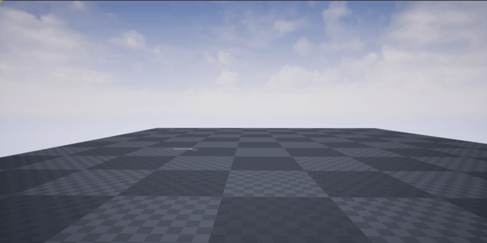 | 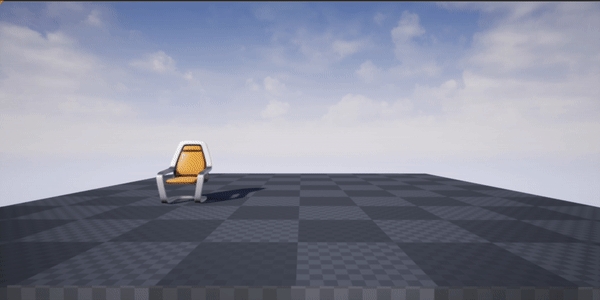 | 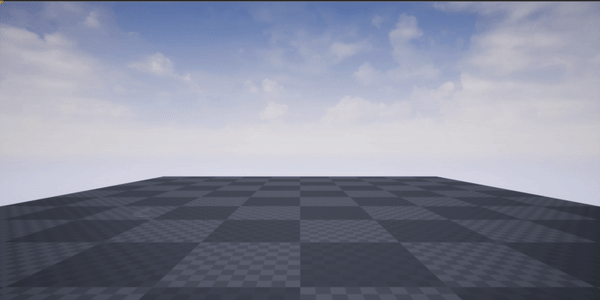 |

---

## 게임플레이 프레임워크

|          언리얼의 게임 프레임워크           |
| :-----------------------------------------: |
| 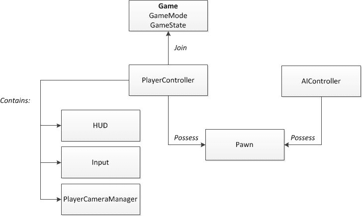 |

- 언리얼은 유니티와 다르게 프레임워크가 짜여있다.
  > 게임은 GameMode와 GameState로 이루어진다.
  >
  > Input, Hud, PlayerCameraManager 등 PlayerController에 포함되어있고,
  >
  > 게임에 참여하는 사람은 PlayerController로 입력받는다.
  >
  > 레벨에 물리적으로 존재할 수 있도록 Pawn에 빙의된다.

### Game Mode

- `Game Mode` 를 이용해 게임 정보를 설정한다.
  > 게임 안의 신적인 존재

|   `World Setting`-`Game Mode`   |
| :-----------------------------: |
| 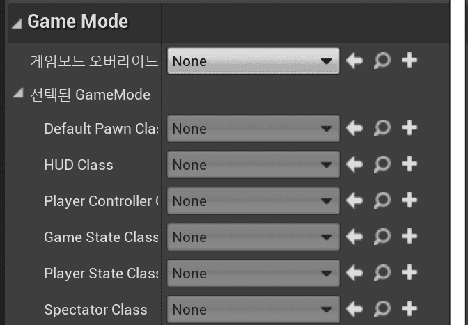 |

- Default Pawn Class
  > 게임이 시작되고 플레이어가 움직일 주인공
- HUD(Head Up Display) Class
  > 화면에 표시될 UI
- Player Controller Class
  > 게임에서 입력을 관리하고 Player의 Pawn을 제어한다.
- Game State Class
  > 게임 규칙, 플레이 방식, 상태를 관리
- Player State Class
  > 플레이어 정보를 관리
- Spectator Class
  > 단순히 동작을 관찰하는 관람객(수동형 플레이어)을 제어

### 실습: 의자를 플레이어로 하는 게임 규칙을 정해보자

1. `Game Mode Base`를 상속받는 MyGameModeBase 클래스 생성
2. `Pawn`을 상속 받는 MyPawn 클래스 생성
   > `Pawn`: 빙의하면 `Controller`로 입력 받을 수 있는 Actor
3. MyPawn에 `Static Mesh Component`를 추가해 의자로 설정해준다.

   - MyPawn.h

   ```cpp
   ...    // #include ...

   UCLASS()
   class TEST_API AMyPawn : public APawn
   {
       GENERATED_BODY()

   public:
       AMyPawn();

   protected:
       virtual void BeginPlay() override;    // from. Actor

   public:
       virtual void Tick(float DeltaTime) override;  // from. Actor

       // Input을 Binding해 입력을 처리하게 해준다.
       virtual void SetupPlayerInputComponent(class UInputComponent* PlayerInputComponent) override;   // from. Pawn

       UPROPERTY(VisibleAnywhere)
       UStaticMeshComponent* Mesh;   // for. 의자 Mesh 설정
   };
   ```

   - MyPawn.cpp

   ```cpp
   ...    // #include ...

   AMyPawn::AMyPawn()    // 생성자에서 의자 메시 로드
   {
       PrimaryActorTick.bCanEverTick = true;   // Tick 호출할건지

       // New
       Mesh = CreateDefaultSubobject<UStaticMeshComponent>(TEXT("MESH"));

       // Root Component 지정
       RootComponent = Mesh;

       // Load
       ConstructorHelpers::FObjectFinder<UStaticMesh> SM_CHAIR(TEXT("StaticMesh'/Game/StarterContent/Props/SM_Chair.SM_Chair'"));
       if (SM_CHAIR.Succeeded())
       {
           Mesh->SetStaticMesh(SM_CHAIR.Object);
       }
   }
   ```

4. MyGameModeBase에 MyPawn을 설정

   - MyGameModeBase.h

   ```cpp
   ...

   UCLASS()
   class TEST_API AMyGameModeBase : public AGameModeBase
   {
       GENERATED_BODY()

   public:
       AMyGameModeBase();    // 처음엔 비어있고 직접 코드로 넣어야 함

   };

   ```

   - MyGameModeBase.cpp

   ```cpp
   ...   // #include ...
   #include "MyPawn.h"   // 해당 스크립트에서 MyPawn을 알려줘야 하므로

   AMyGameModeBase::AMyGameModeBase()
   {
       // Game Mode Base 클래스 안의 "Default..."가 존재한다.
       // Static 객체를 얻어옴(by. Reflection)
       // Default Pawn은 MyPawn으로 지정
       DefaultPawnClass = AMyPawn::StaticClass();
   }

   ```

5. World Setting-Game Mode 를 MyGameModeBase로 설정

   |            MyGameModeBase 설정            |
   | :---------------------------------------: |
   |  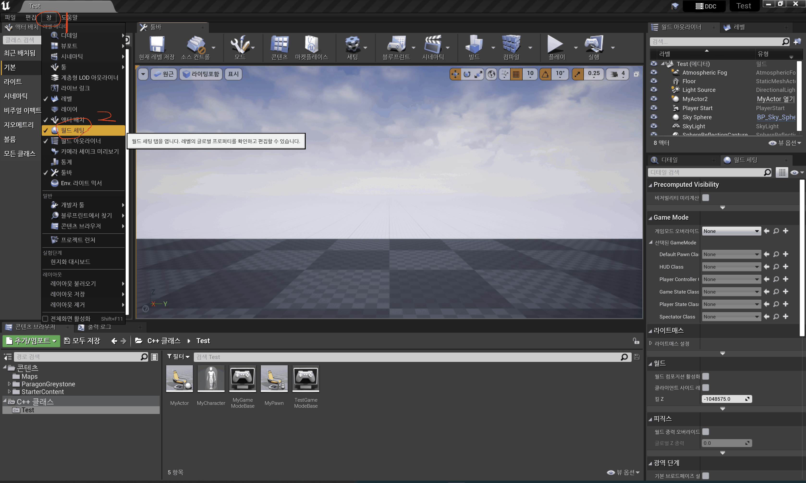  |
   | 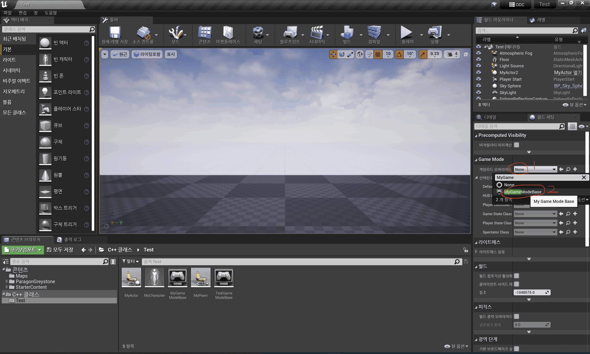 |

- 결과

| Default Pawn Class 설정되기 전, 빙의 빠져 나온 상태(`F8` 입력) | Default Pawn Class 설정된 후, 빙의 빠져 나온 상태(`F8` 입력) |
| :------------------------------------------------------------: | :----------------------------------------------------------: |
|             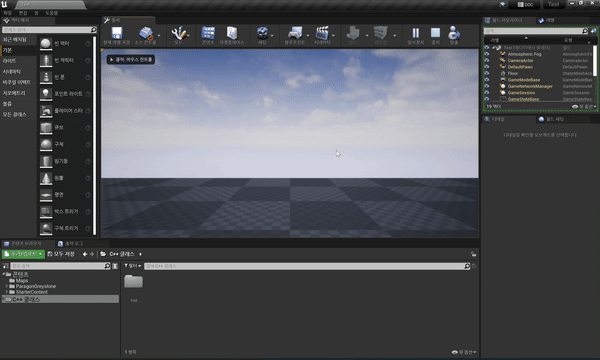              |     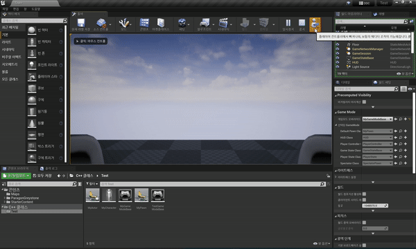     |

### 실습: Pawn에 Input을 주고 움직여보자

- Unity 입력 vs Unreal 입력

  |                                    Unity                                    |                                                                Unreal                                                                 |
  | :-------------------------------------------------------------------------: | :-----------------------------------------------------------------------------------------------------------------------------------: |
  |   `Update()`에서 Input을 받고 매 프레임마다 관련 로직을 실행하도록 한다.    | `SetUpPlayerInputComponent()` 에서 입력을 바인딩하고 `Project Setting`-`Input` 에서 입력 키들을 맵핑하고 관련 함수를 호출하도록 한다. |
  | Unity New Input System에서는 언리얼과 동일하게 바인딩해서 적용시킬 수 있다. |                                                                                                                                       |

1. MyPawn에 Input Binding

   - MyPawn.h

   ```cpp
   ...   // #include ...

   UCLASS()
   class TEST_API AMyPawn : public APawn
   {
       GENERATED_BODY()

   public:
       AMyPawn();

   protected:
       virtual void BeginPlay() override;

   public:
       virtual void Tick(float DeltaTime) override;

       // Input을 Binding하는 함수
       virtual void SetupPlayerInputComponent(class UInputComponent* PlayerInputComponent) override;

       void UpDown(float Value);     // Binding될 함수
       void LeftRight(float Value);  // Binding될 함수

       UPROPERTY(VisibleAnywhere)
       UStaticMeshComponent* Mesh;   // 의자 메시

       UPROPERTY(VisibleAnywhere)
       class UFloatingPawnMovement* Movement;    // 이동 관련 컴포넌트
       // class: 전방 선언
   };

   ```

   - MyPawn.cpp

   ```cpp
   ...   // #include ...
   #include "GameFramework/FloatingPawnMovement.h"   // 헤더에서 전방 선언 후, UFloatingPawnMovement 사용하기 위해 선언

   AMyPawn::AMyPawn()
   {
       ... // 이전 코드들과 일치: 메시 생성

       Movement = CreateDefaultSubobject<UFloatingPawnMovement>(TEXT("MOVEMENT"));

       ... // 이전 코드들과 일치: 의자 메시 로드
   }

   ...   // BeginPlay(), Tick()

   void AMyPawn::SetupPlayerInputComponent(UInputComponent* PlayerInputComponent)
   {
       // Player Controller 에서 바인딩하면 먼저 선점 가능하다.
       Super::SetupPlayerInputComponent(PlayerInputComponent);

       // Bind Axis: UpDown(), LeftRight()를 Bind
       PlayerInputComponent->BindAxis(TEXT("UpDown"), this, &AMyPawn::UpDown);
       PlayerInputComponent->BindAxis(TEXT("LeftRight"), this, &AMyPawn::LeftRight);
   }

   void AMyPawn::UpDown(float Value)
   {
       // 출력해보면 입력하지 않으면 0도 출력된다.
       //UE_LOG(LogTemp, Warning, TEXT("UpDown: %f"), Value);

       if (Value == 0.f)
         return;

       // Parameter: 1) 방향, 2) 크기
       // Forward 방향으로 Value만큼 이동
       AddMovementInput(GetActorForwardVector(), Value);
   }

   void AMyPawn::LeftRight(float Value)
   {
       // 출력해보면 입력하지 않으면 0도 출력된다.
       //UE_LOG(LogTemp, Warning, TEXT("LeftRight: %f"), Value);

       if (Value == 0.f)
         return;

       // Parameter: 1) 방향, 2) 크기
       // Right 방향으로 Value만큼 이동
       AddMovementInput(GetActorRightVector(), Value);
   }

   ```

2. `Project Setting`-`Input`에서 키 맵핑

   > `PlayerInputComponent->BindAxis(TEXT("맵핑 이름"), ...)`
   >
   > 반드시 맵핑 이름과 일치해야 함

   |                      축 매핑 방법                       |
   | :-----------------------------------------------------: |
   |       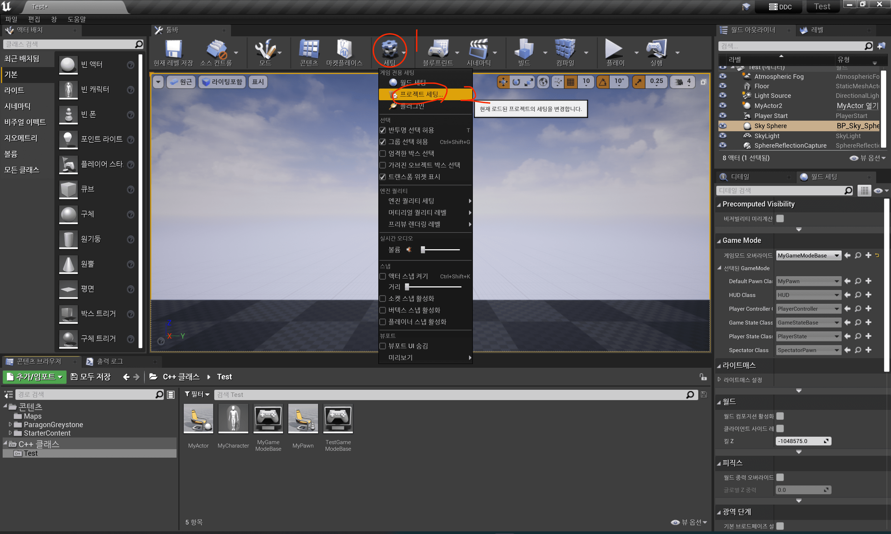       |
   | 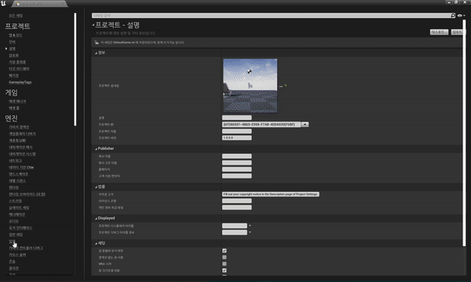 |

- 결과

  |               의자(= 플레이어) 움직임               |
  | :-------------------------------------------------: |
  | 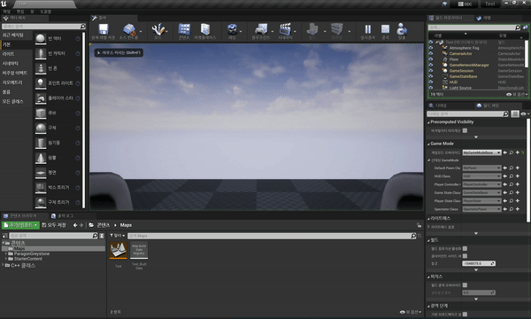 |

---

## 캐릭터 생성

- Pawn vs Character

  |                       Pawn                        |                                   Character                                   |
  | :-----------------------------------------------: | :---------------------------------------------------------------------------: |
  |                                                   |   SkeletalMesh: 뼈대를 이용해 움직일 수 있는 메시 컴포넌트(for. Animation)    |
  | PawnMovement: Pawn이 움직일 수 있게 하는 컴포넌트 | CharacterMovement: 걷기, 달리기, 점프, 비행 등을 움직일 수 있게 하는 컴포넌트 |
  |                                                   |         Capsule: 콜리전, 트리거로 사용될 수 있는 캡슐 모양의 컴포넌트         |
  |                                                   |                    Arrow: 화살표 방향을 나타내는 컴포넌트                     |

### Character Class를 생성해 움직여보자

1. 마켓 스토어에서 Paragon 에셋 다운로드 후 프로젝트에 추가

   |               Paragon: Greystone 추가               |
   | :-------------------------------------------------: |
   | 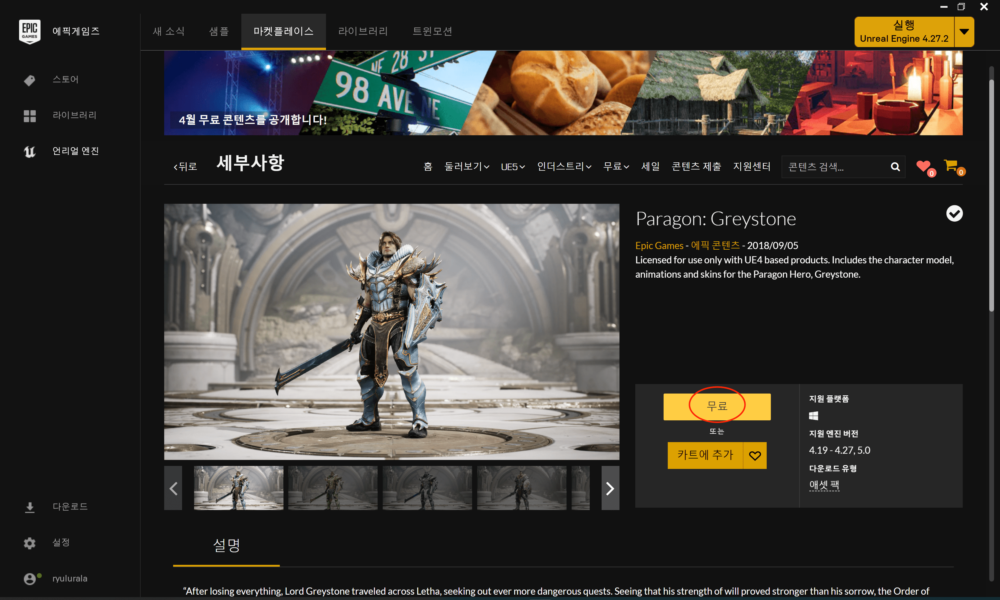 |
   | 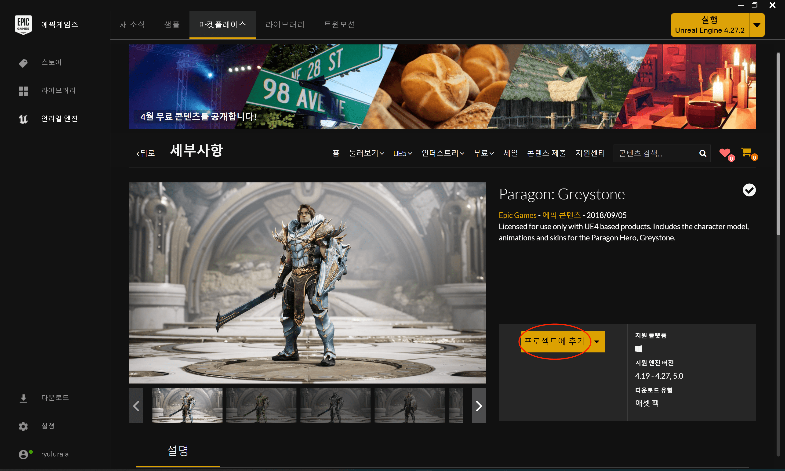 |

2. Character Class 생성

   - MyCharacter.h

     ```cpp
     ... // #include ...

     UCLASS()
     class TEST_API AMyCharacter : public ACharacter
     {
         GENERATED_BODY()

     public:
         AMyCharacter();

     protected:
         virtual void BeginPlay() override;

     public:
         virtual void Tick(float DeltaTime) override;

         virtual void SetupPlayerInputComponent(class UInputComponent* PlayerInputComponent) override;

         // Input Binding할 함수
         void UpDown(float Value);
         void LeftRight(float Value);

         // Mesh, Input 컴포넌트 모두 Character에 포함돼있다.
     };
     ```

   - MyCharacter.cpp

     ```cpp
     ... // #include ...

     AMyCharacter::AMyCharacter()
     {
         PrimaryActorTick.bCanEverTick = true;

         // Skeletal Mesh 로드
         ConstructorHelpers::FObjectFinder<USkeletalMesh> SK_PARAGON(TEXT("SkeletalMesh'/Game/ParagonGreystone/Characters/Heroes/Greystone/Meshes/Greystone.Greystone'"));
         if (SK_PARAGON.Succeeded())
         {
             // Mesh가 이미 상속받은 Character class에 private으로 선언돼있다.
             GetMesh()->SetSkeletalMesh(SK_PARAGON.Object);
         }
     }

     ... // BeginPlay(), Tick()

     void AMyCharacter::SetupPlayerInputComponent(UInputComponent* PlayerInputComponent)
     {
         Super::SetupPlayerInputComponent(PlayerInputComponent);

         // Player Controller 에서 바인딩하면 먼저 선점 가능하다.
         // Axis 바인딩
         PlayerInputComponent->BindAxis(TEXT("UpDown"), this, &AMyCharacter::UpDown);
         PlayerInputComponent->BindAxis(TEXT("LeftRight"), this, &AMyCharacter::LeftRight);
     }

     void AMyCharacter::UpDown(float Value)
     {
         //UE_LOG(LogTemp, Warning, TEXT("UpDown: %f"), Value);

         if (Value == 0.f)
           return;

         // Parameter: 1) 방향, 2) 크기
         AddMovementInput(GetActorForwardVector(), Value);
     }

     void AMyCharacter::LeftRight(float Value)
     {
         //UE_LOG(LogTemp, Warning, TEXT("LeftRight: %f"), Value);

         if (Value == 0.f)
           return;

         // Parameter: 1) 방향, 2) 크기
         AddMovementInput(GetActorRightVector(), Value);
     }

     ```

3. MyGameModeBase 수정

   - MyGameModeBase.cpp

     ```cpp
     #include "MyGameModeBase.h"
     #include "MyCharacter.h"    // MyPawn -> MyCharacter

     AMyGameModeBase::AMyGameModeBase()
     {
         // Pawn이 상위 개념이므로 Character로 설정 가능
         DefaultPawnClass = AMyCharacter::StaticClass();
     }
     ```

- 결과

  |                 파라곤 캐릭터 움직임                  |
  | :---------------------------------------------------: |
  | 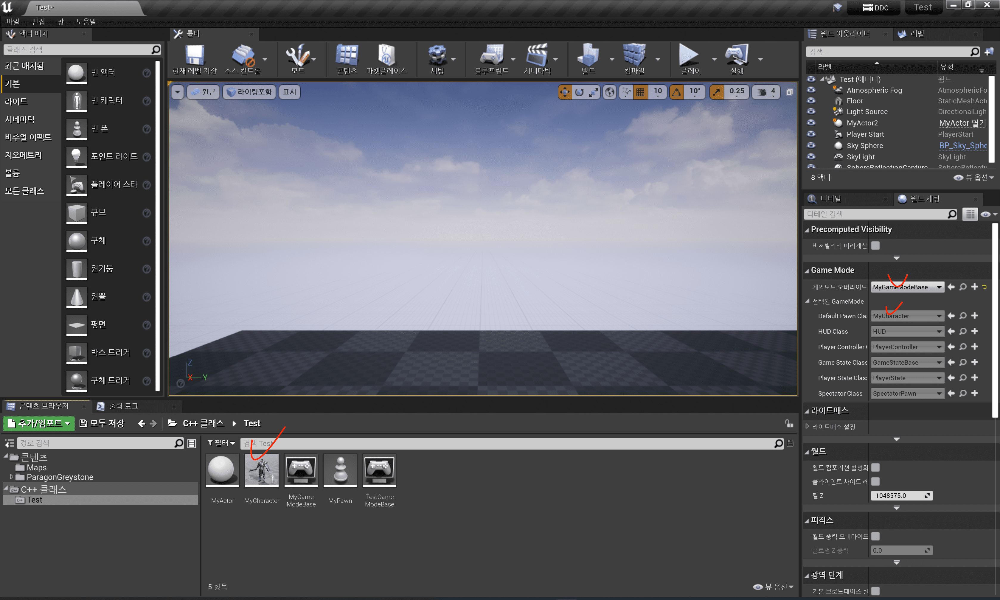 |
  | 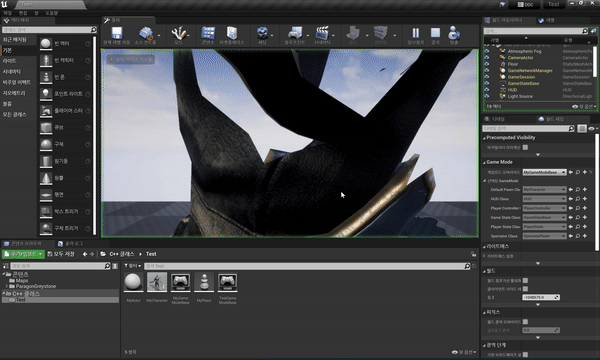 |

### 카메라를 설정해보자

- Character class 에 컴포넌트 추가

  - Spring
    > 일종의 셀카봉
  - Camera

    > 카메라 본체

  - MyCharacter.h

    ```cpp
    ... // #include ...

    UCLASS()
    class TEST_API AMyCharacter : public ACharacter
    {
        GENERATED_BODY()

      public:
        // Sets default values for this character's properties
        AMyCharacter();

        ...

      private:
        // class: 전방 선언
        UPROPERTY(VisibleAnywhere)
        class USpringArmComponent* SpringArm;   // 셀카봉

        UPROPERTY(VisibleAnywhere)
        class UCameraComponent* Camera;         // 카메라 본체
    };

    ```

  - MyCharacter.cpp

    ```cpp
    #include "MyCharacter.h"

    // 전방 선언한 내용들
    #include "GameFramework/SpringArmComponent.h"   // Spring: 셀카봉
    #include "Camera/CameraComponent.h"             // Camera: 카메라 본체
    #include "Components/CapsuleComponent.h"

    AMyCharacter::AMyCharacter()
    {
        PrimaryActorTick.bCanEverTick = true;

        // 메시와 다르게 컴포넌트를 추가한 것이기 때문에 직접 추가해줘야 함
        SpringArm = CreateDefaultSubobject<USpringArmComponent>(TEXT("SPRINGARM"));
        Camera = CreateDefaultSubobject<UCameraComponent>(TEXT("CAMERA"));

        // 계층 구조로 부모를 정함
        SpringArm->SetupAttachment(GetCapsuleComponent());
        Camera->SetupAttachment(SpringArm);

        SpringArm->TargetArmLength = 500.0f;    // 거리
        SpringArm->SetRelativeRotation(FRotator(-35.0f, 0.0f, 0.0f)); // 회전

        // -88.0f: 땅에서 88.0f 만큼 공중에 떠 있는 위치를 바닥에 붙여놓기 위함
        // -90.0f: X방향을 월드의 X방향과 맞추기 위함
        GetMesh()->SetRelativeLocationAndRotation(FVector(0.0f, 0.0f, -88.0f), FRotator(0.0f, -90.0f, 0.0f));

        ...
    }
    ```

- 결과

  |             MyCharacter의 계층 구조와 결과              |
  | :-----------------------------------------------------: |
  | 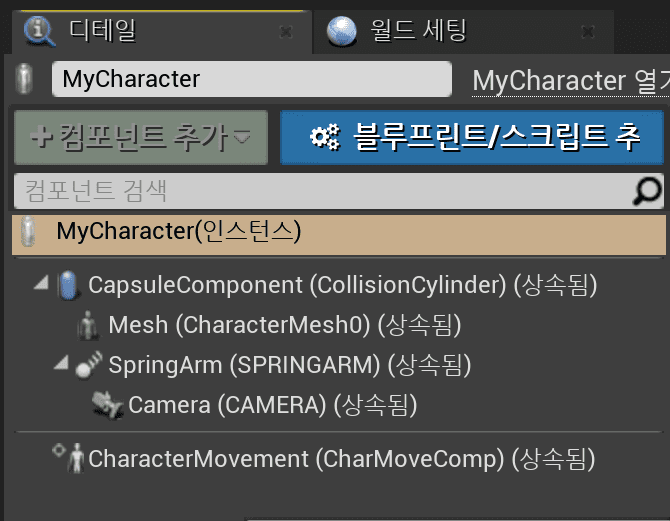 |
  |  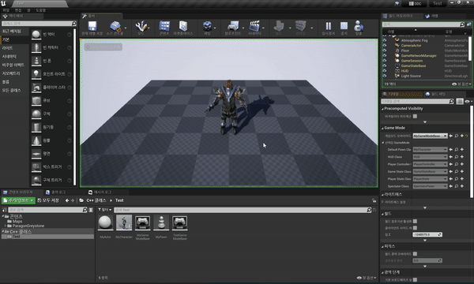  |

### 마우스를 돌리면 캐릭터가 회전이 되도록 하자

1. Project Setting-Inputd 에서 Axis 맵핑 추가

   |       프로젝트세팅-입력       |
   | :---------------------------: |
   | 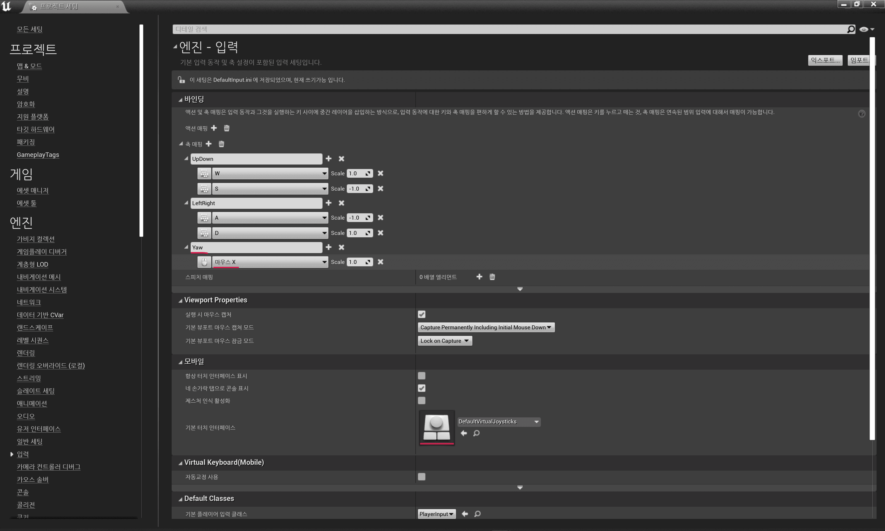 |

2. Character Class 코드 작성

   - MyCharacter.h

     ```cpp
     ...

     public:
         void UpDown(float Value);
         void LeftRight(float Value);
         void Yaw(float Value);    // Yaw Input Binding할 함수

     ```

   - MyCharacter.cpp

     ```cpp
     ...

     void AMyCharacter::SetupPlayerInputComponent(UInputComponent* PlayerInputComponent)
     {
         Super::SetupPlayerInputComponent(PlayerInputComponent);

         ...

         // Yaw Input Binding
         PlayerInputComponent->BindAxis(TEXT("Yaw"), this, &AMyCharacter::Yaw);
     }

     ...

     void AMyCharacter::Yaw(float Value)
     {
         // Controller에 Yaw 입력을 가함
         AddControllerYawInput(Value);
     }

     ```

- 결과

  |    Use Controller Rotation Yaw 가 체크되어 있어 회전이 가능하다.    |
  | :-----------------------------------------------------------------: |
  | 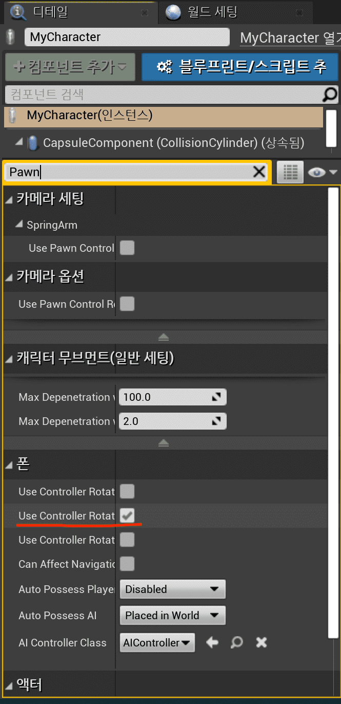 |

  |                         마우스 Yaw 회전                         |
  | :-------------------------------------------------------------: |
  | 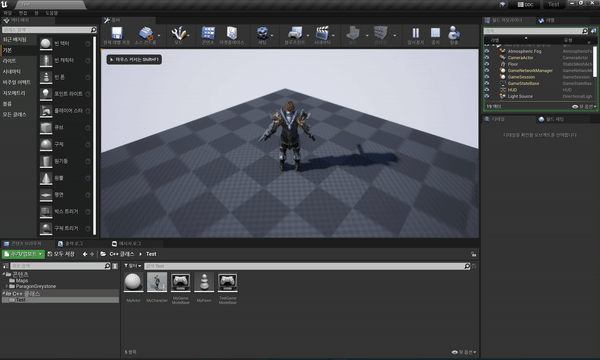 |

---

## 블루프린트 클래스

- 블루프린트(Blueprint)란?

  > 비주얼 스크립트 가능한 시스템으로 에디터 내에서 오브젝트를 정의한다.
  >
  > Blueprint는 C++ 보다 10배 가량 느리다.
  >
  > C++ 클래스를 BP로 상속 받는 건 가능하지만, BP를 상속받는 C++ 불가

|                 뷰포트(Viewport)                  |                           Construction Script                           |               이벤트 그래프(Event Graph)                |
| :-----------------------------------------------: | :---------------------------------------------------------------------: | :-----------------------------------------------------: |
| 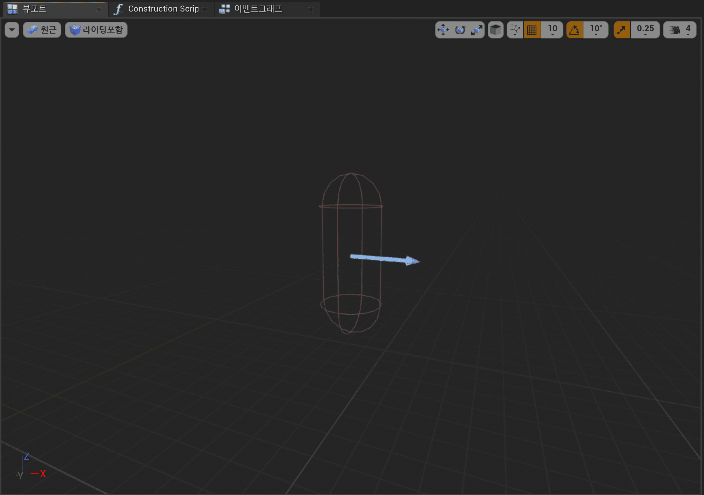 | 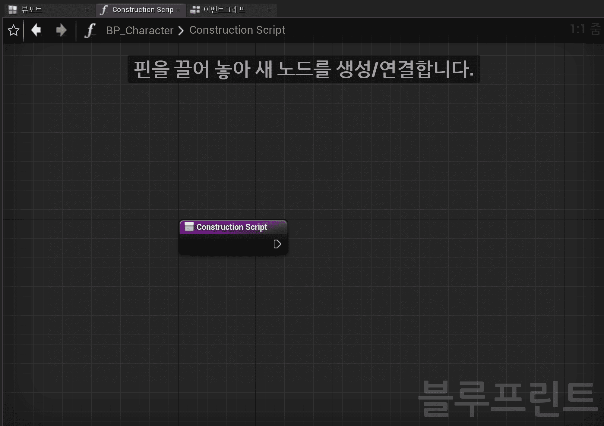 | 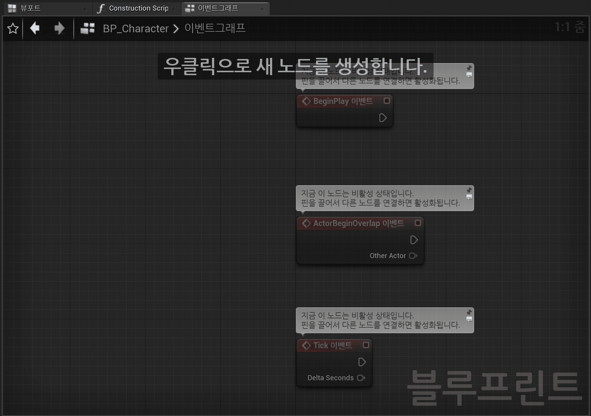 |
|         컴포넌트, 메시 등을 확인하고 조작         | 에디터에서 액터가 배치 or 업데이트될 때 사용(게임 플레이 이전 스크립팅) |     게임 플레이에 실행되는 스크립팅을 함(게임 로직)     |

### `C++` MyCharacter를 `블루프린트`로 바꿔보자

1. 블루프린트 클래스 생성

   |          Character를 부모 클래스로 갖는 블루프린트 생성           |
   | :---------------------------------------------------------------: |
   | 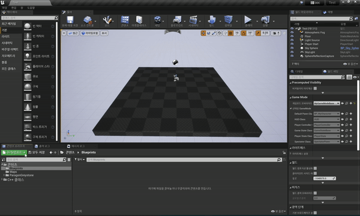 |

2. MyCharacter Class의 생성자와 비교하며 BP_MyCharacter의 Detail 설정

   - Mesh, 위치, 회전 설정

     |                   Mesh 설정                   |                       위치 조절                       |                       회전 조절                       |
     | :-------------------------------------------: | :---------------------------------------------------: | :---------------------------------------------------: |
     |  | 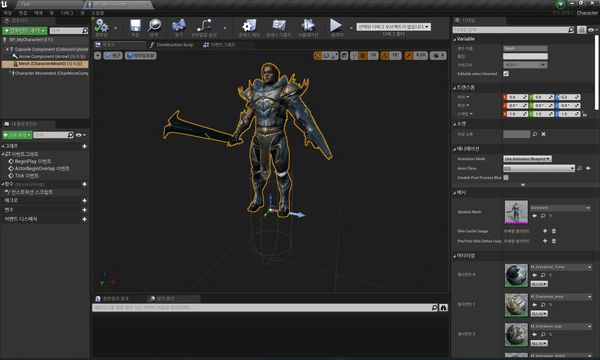 | 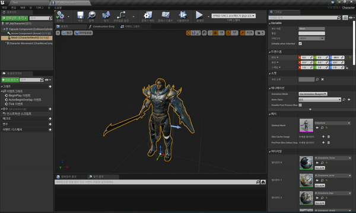 |

   - Camera, 스프링암 컴포넌트 추가

     |                          컴포넌트 추가                          |                       TargetArm Length, 회전 조절                       |
     | :-------------------------------------------------------------: | :---------------------------------------------------------------------: |
     | 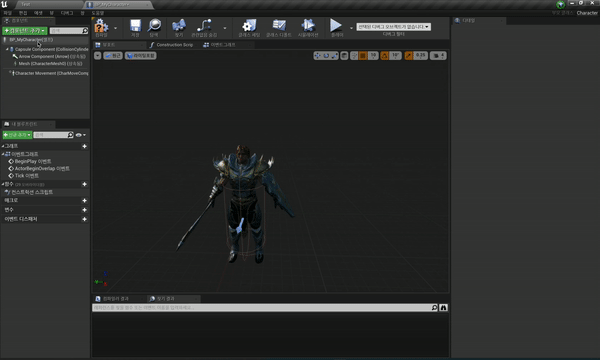 | 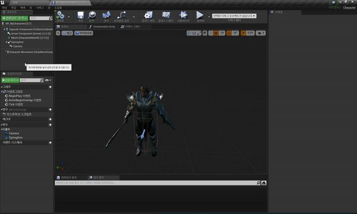 |

   - MyGameModeBase의 Default Pawn을 BP_MyCharacter로 설정

     ```cpp
     #include "MyGameModeBase.h"
     #include "MyCharacter.h"

     AMyGameModeBase::AMyGameModeBase()
     {
         //DefaultPawnClass = AMyCharacter::StaticClass();    // Static 객체

         static ConstructorHelpers::FClassFinder<ACharacter> BP_CHARACTER(TEXT("Blueprint'/Game/Blueprints/BP_MyCharacter.BP_MyCharacter_C'")); // "_C" Suffix 추가
         if (BP_CHARACTER.Succeeded())
         {
             DefaultPawnClass = BP_CHARACTER.Class;
         }
     }
     ```

3. 이동 관련 함수도 설정

   |                          LeftRight, UpDown, Yaw                           |
   | :-----------------------------------------------------------------------: |
   | 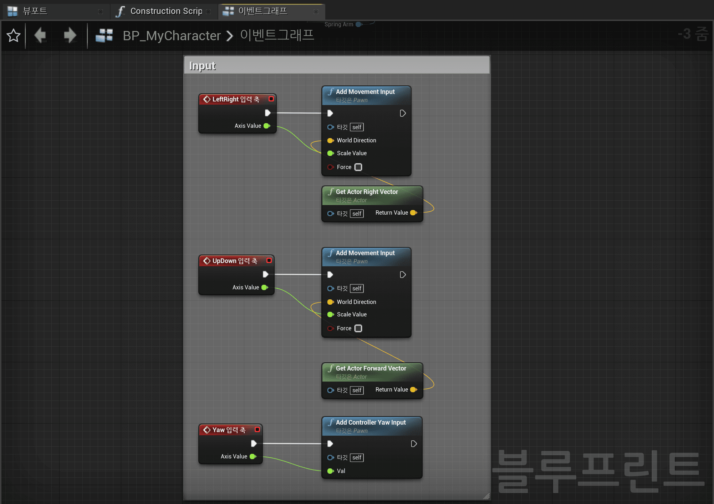 |

- 결과

  |                   BP MyCharacter 배치 후 이동시키기                   |
  | :-------------------------------------------------------------------: |
  | 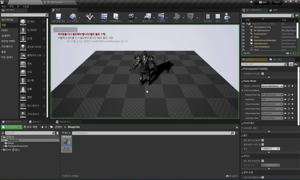 |

### `C++` MyCharacter 를 상속받는 `Blueprint` MyCharacter 만들어보자

- C++을 부모 클래스로 하는 Blueprint 클래스를 만들 수 있다.

  - Blueprint를 부모 클래스로 하는 C++ 클래스 생성은 불가능!

- 두 가지 방법 존재

  |      1) 부모 클래스를 지정 -> 블루프린트 클래스 생성      |       2) 블루프린트 클래스 생성 -> 부모 클래스 지정       |
  | :-------------------------------------------------------: | :-------------------------------------------------------: |
  | 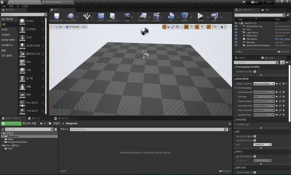 | 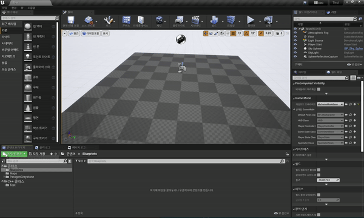 |
  |        부모 클래스를 지정한 후 클래스를 생성한다.         |         클래스 세팅에서 부모 클래스를 지정해준다.         |

---
